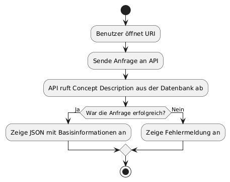
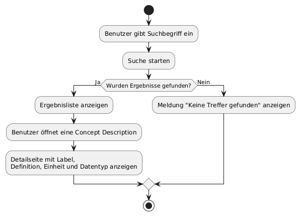
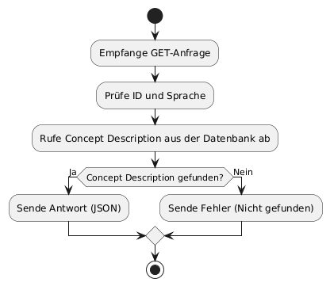
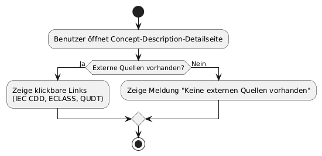
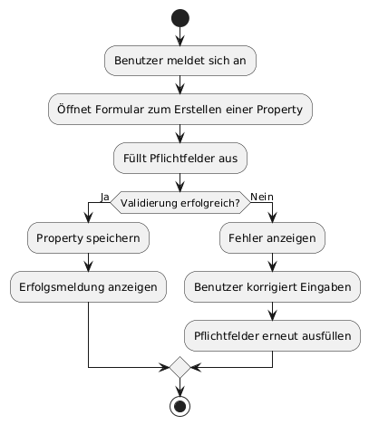

# Lastenheft

*Dokumentverantwortlicher: Produktmanager, Kristanna Pfeil*

## Versionskontrolle:

| Version | Datum      | Autor       | Kommentar                         |
|-|-|-|-|
| 1.0     | 15.10.2025 | Kristanna Pfeil | Erstellung & erster Entwurf |
| 2.0     | 23.10.2025 | Kristanna Pfeil | Überarbeitung & Ergänzung   |
|3.0    | 07.11.2025 | Kristanna Pfeil | Überarbeitung & neue Formatierung |


<br>

## Inhaltsverzeichnis

- [Lastenheft](#lastenheft)
  - [Versionskontrolle:](#versionskontrolle)
  - [Inhaltsverzeichnis](#inhaltsverzeichnis)
  - [1. Einführung in das Lastenheft - CRS](#1-einführung-in-das-lastenheft---crs)
  - [2. Ausgangssituation](#2-ausgangssituation)
  - [3. Projektziel](#3-projektziel)
  - [4. Stakeholder](#4-stakeholder)
  - [5. Anwendungsfälle - Use Cases](#5-anwendungsfälle---use-cases)
    - [5.1 Use Case 01 - URI](#51-use-case-01---uri)
    - [5.2 Use Case 02 - Suche \& Detailansicht](#52-use-case-02---suche--detailansicht)
    - [5.3 Use Case 03 - REST-Abfrage für AAS](#53-use-case-03---rest-abfrage-für-aas)
    - [5.4 Use Case 04 - Quellenverweis](#54-use-case-04---quellenverweis)
    - [5.5 Use Case 05 - Pflege der Datensätze](#55-use-case-05---pflege-der-datensätze)
  - [6. Anforderungen](#6-anforderungen)
    - [6.1 Funktionale Anforderungen](#61-funktionale-anforderungen)
      - [6.1.1 FA-001 - Auflösbare URIs für Concept Descriptions bereitstellen](#611-fa-001---auflösbare-uris-für-concept-descriptions-bereitstellen)
      - [6.1.2 FA.002 - REST‑API zum Abrufen von Concept Descriptions](#612-fa002---restapi-zum-abrufen-von-concept-descriptions)
      - [6.1.3 FA.003 - Mapping auf IEC61360‑Datentemplate](#613-fa003---mapping-auf-iec61360datentemplate)
      - [6.1.4 FA.004 - REST‑API Sprache](#614-fa004---restapi-sprache)
      - [6.1.5 FA.005 - Edit‑Workflow](#615-fa005---editworkflow)
      - [6.1.6 FA.006 - Verlinkung externen Quellen](#616-fa006---verlinkung-externen-quellen)
      - [6.1.7 FA.007 - Import/Export mit AAS](#617-fa007---importexport-mit-aas)
      - [6.1.8 FA.008 - Leichte Spezifikation \& Governance](#618-fa008---leichte-spezifikation--governance)
      - [6.1.9 FA.009 - Standardisierung](#619-fa009---standardisierung)
      - [6.1.10 FA.010 - Benutzerfreundlichkeit](#6110-fa010---benutzerfreundlichkeit)
    - [6.2 Nicht-funktionale Anforderungen (NFR)](#62-nicht-funktionale-anforderungen-nfr)
      - [6.2.1  NFA.001 - Verfügbarkeit / Stabilität](#621--nfa001---verfügbarkeit--stabilität)
      - [6.2.2 NFA.002 - Performance](#622-nfa002---performance)
      - [6.2.3 NFA.003 - Sicherheit](#623-nfa003---sicherheit)
      - [6.2.4 NFA.004 - Usability](#624-nfa004---usability)
      - [6.2.5 NFA.005 - Wartbarkeit / Codequalität](#625-nfa005---wartbarkeit--codequalität)
    - [6.3 Randbedingungen](#63-randbedingungen)
  - [7. Anhang](#7-anhang)

---

## 1. Einführung in das Lastenheft - CRS

Das Lastenheft enthält alle gewünschten Anforderungen vom Kunden (Anforderungen, Stakeholder) für das Projekt "Semantic Wikibase".
Das Lastenheft ist ein Dokument, in dem der Auftraggeber alle Anforderungen, Wünsche und Ziele an das geplante Produkt oder Projekt beschreibt. Es legt also fest, was erreicht und zum Teil wie es umgesetzt werden soll. 
<br>

Das Lastenheft dient als Grundlage für die Kommunikation zwischen Auftraggeber und Auftragnehmer und ist die Basis für die Erstellung des Pflichtenhefts. Ziel des Lastenhefts ist es, sicherzustellen, dass beide Seiten ein gemeinsames Verständnis über den Leistungsumfang und die Erwartungen haben.

## 2. Ausgangssituation

In der Asset Administration Shell (AAS) werden Eigenschaften von Submodellen über **Concept Descriptions** beschrieben. Diese verweisen oft auf Inhalte aus **IEC 61360**, **ECLASS** oder anderen Katalogen. Heute sind solche Beschreibungen häufig lokal im AAS-Repository gespeichert, schwer über das Web aufzulösen und nicht einheitlich per API abfragbar. Dadurch ist die Wiederverwendbarkeit begrenzt und Integrationen sind umständlich. <br>
Zudem ist die Benutzerfreundlichkeit vieler bestehender Plattformen, wie z.B. "AAS-Connect", nicht sehr intuitiv, was die Nutzung und Verwaltung von Concept Descriptions zusätzlich erschwert.

## 3. Projektziel

Das Ziel des Projekts „Semantic Wikibase“ ist die Entwicklung einer öffentlichen, webbasierten Plattform, die auf Wikibase-Technologie basiert und besonders benutzerfreundlich gestaltet wird. <br>
Nutzer sollen auf einfache Weise eigene Begriffe und Eigenschaften mit auflösbaren URIs veröffentlichen können, wodurch diese Informationen direkt und unkompliziert für verschiedene Anwendungen und Systeme verfügbar gemacht werden. Die Plattform verfolgt das Ziel, semantische Daten für Unternehmen als auch Privatpersonen zugänglich zu machen und dabei die Hürden existierender, oft komplexer Systeme wie ECLASS oder IEC-CDD zu überwinden.<br>
Ein besonderer Fokus liegt darauf, die Bedienung intuitiv und den Zugang niedrigschwellig zu halten, damit auch Nutzer ohne tiefgehende technische Kenntnisse die Plattform problemlos nutzen können. Darüber hinaus soll eine REST-API entwickelt werden, die semantische Daten und Definitionen sprachabhängig für verschiedenste Systeme bereitstellt.

## 4. Stakeholder


| Stakeholder                                     | Ziel                                                               |
| ----------------------------------------------- | ------------------------------------------------------------------------------- |
| **Studierenden-Team (Entwicklung)**             | Klare Anforderungen und realisierbarer Umfang.   |
| **Dozierende / Betreuer**                       | Funktionsfähige und verbesserte Plattform mit nachvollziehbarer Dokumentation und Präsentation. |
| **AAS-Tool-Anwender** (z. B. mit AASX-Explorer) | Stabile URIs, einfache und standardisierte API-Antworten.                       |
| **Systemintegratoren**                          | Leicht integrierbare REST-API für bestehende AAS-Infrastrukturen.               |
| **Community**         | Offene Plattform mit niedrigen Einstiegshürden.|
| **Externe Datenanbieter (IEC, ECLASS, QUDT)**   | Wahrung der Quellen, vermeidung von Lizenzverstößen und Verlinkung.      |


## 5. Anwendungsfälle - Use Cases

### 5.1 Use Case 01 - URI
| Use Case ID  | UC01 |
|--------------|------|
| Beschreibung | Das AAS-Tool nutzt die URI einer Eigenschaft (z.B. Nennspannung) und erhält direkt alle Basisinformationen maschinenlesbar. |
| Beteiligte Rollen | Nutzer, AAS-Server |
| Systemgrenze | API-Endpunkt/AAS-Server |
| Vorbedingung | Die URI der Eigenschaft ist bekannt. Nutzer hat ein AAS-Modell. |
| Nachbedingung bei Erfolg | Nutzer erhält ein JSON mit allen relevanten Infos zum Konzept. |
| Auslösendes Ereignis | Aufruf der URI über das Tool/API. |



### 5.2 Use Case 02 - Suche & Detailansicht

| Use Case ID  | UC02 |
|--------------|------|
| Beschreibung | Nutzer sucht Konzept und öffnet Detailseite mit Einheit, Datentyp, Quellenlinks etc. |
| Beteiligte Rollen | Nutzer |
| Systemgrenze | Web-UI |
| Vorbedingung | Begriff existiert im System. |
| Nachbedingung bei Erfolg | Detailseite mit allen Infos und Verlinkungen wird angezeigt. |
| Auslösendes Ereignis | Suche und Öffnen eines Concepts. |



### 5.3 Use Case 03 - REST-Abfrage für AAS

| Use Case ID  | UC03 |
|--------------|------|
| Beschreibung | REST-Abfrage für AAS: `/api/v1/iec61360/{id}?lang=de`. Liefert schlankes JSON mit den Beschreibungselementen in der angegeben Sprache. |
| Beteiligte Rollen | Entwickler, AAS-Systeme |
| Systemgrenze | API |
| Vorbedingung | Konzept existiert. |
| Nachbedingung bei Erfolg | JSON mit allen Concept-Informationen wird zurückgegeben. |
| Auslösendes Ereignis | Request gegen API-Endpunkt. |



### 5.4 Use Case 04 - Quellenverweis

| Use Case ID  | UC04 |
|--------------|------|
| Beschreibung | Nutzer sieht Verlinkungen zu externen Quellen (IEC‑CDD/ECLASS/QUDT ...) auf Detailseite. |
| Beteiligte Rollen | Nutzer |
| Systemgrenze | Web-UI |
| Vorbedingung | Konzept besitzt Quellenverweise. |
| Nachbedingung bei Erfolg | Klickbare Links werden dargestellt. |
| Auslösendes Ereignis | Aufruf der Detailansicht eines Concepts. |



### 5.5 Use Case 05 - Pflege der Datensätze

| Use Case ID  | UC05 |
|--------------|------|
| Beschreibung | Editor legt Properties im System an, inkl. Label, Definition, Einheit, Datentyp. |
| Beteiligte Rollen | Editor |
| Systemgrenze | Web-UI/Wikibase-Frontend |
| Vorbedingung | Editor ist angemeldet/berechtigt. |
| Nachbedingung bei Erfolg | Neue Properties sind angelegt und abrufbar. |
| Auslösendes Ereignis | Erstellen eines Eintrags im System. |




## 6. Anforderungen

### 6.1 Funktionale Anforderungen

#### 6.1.1 FA-001 - Auflösbare URIs für Concept Descriptions bereitstellen

|Requirement ID|FA.001|
|--------------|------|
|Übersicht|Für jedes Konzept wird eine eindeutige, auflösbare Web-Adresse (URI) bereitgestellt. Beim Aufruf im Browser oder per API wird die jeweilige Beschreibung angezeigt.|
|Erfüllungskriterium|Beim Aufrufen der URI erscheint die  Detailseite (HTML).|

#### 6.1.2 FA.002 - REST‑API zum Abrufen von Concept Descriptions

|Requirement ID|FA.002|
|--------------|------|
|Übersicht|Es wird eine REST-API angeboten, über die Concept Descriptions abgerufen, angelegt, bearbeitet und gelöscht werden können. Die API liefert strukturierte JSON-Daten im IEC 61360 Format.|
|Erfüllungskriterium|Die API deckt alle geforderten Funktionen ab und gibt die Concept Descriptions entsprechend des IEC 61360 Standards als JSON-Objekte aus.|

#### 6.1.3 FA.003 - Mapping auf IEC61360‑Datentemplate

|Requirement ID|FA.003|
|--------------|------|
|Übersicht|Concept Descriptions werden nach dem internationalen IEC 61360 Standard modelliert und enthalten alle zugehörigen Felder (Name, Definition, Datentyp, Einheit, IRDI Identifier).|
|Erfüllungskriterium|Jedes gespeicherte Konzept enthält alle relevanten Felder des IEC 61360 Standards und kann über die Plattform und API abgerufen werden.|

#### 6.1.4 FA.004 - REST‑API Sprache

|Requirement ID|FA.004|
|--------------|------|
|Übersicht|Der REST-API Endpunkt `/api/v1/iec61360/{id}?lang=xx` gibt die geforderten Felder eines Konzepts im kompakten, und in der gewählten Sprache im JSON-Format zurück.|
|Erfüllungskriterium|Das API-JSON entspricht dem im Anhang gezeigten Beispiel und enthält alle konzeptrelevanten Felder, gefiltert nach gewünschter Sprache.|

#### 6.1.5 FA.005 - Edit‑Workflow

|Requirement ID|FA.005|
|--------------|------|
|Übersicht|Die Plattform erlaubt es, neue Concept Descriptions einfach zu erfassen und bestehende zu bearbeiten.|
|Erfüllungskriterium|Nutzer können selbstständig neue Einträge anlegen und vorhandene bearbeiten.|

#### 6.1.6 FA.006 - Verlinkung externen Quellen

|Requirement ID|FA.006|
|--------------|------|
|Übersicht|Die Detailansicht eines Konzepts enthält anklickbare Links zu externen Quellen und Normen (beispielsweise IEC-CDD, ECLASS, QUDT).|
|Erfüllungskriterium|Für referenzierte Concept Descriptions mit externen Beziehungen werden in der Detailansicht klickbare Links angezeigt und führen korrekt zu den externen Quellen.|

#### 6.1.7 FA.007 - Import/Export mit AAS

|Requirement ID|FA.007|
|--------------|------|
|Übersicht|Die Semantic Wikibase ermöglicht den Import und Export von AAS-Daten und ist mit der Asset Administration Shell (AAS) integrierbar (z.B. mit AASX-Dateien).|
|Erfüllungskriterium|AAS-Daten können von Nutzern importiert, verknüpft und im standardisierten Format exportiert werden. Die Daten stehen danach über die Plattform oder API zur Verfügung.|

#### 6.1.8 FA.008 - Leichte Spezifikation & Governance

|Requirement ID|FA.008|
|--------------|------|
|Übersicht|Für die Erstellung und Pflege von Concept Descriptions gelten eindeutige und einfache Mindestvorgaben: Name, Definition, Sprache, Datentyp und Quelle sind verpflichtend.|
|Erfüllungskriterium|Die Plattform stellt bei der Erfassung sicher, dass alle Pflichtfelder ausgefüllt sind, sodass jedes Konzept eindeutig und nachvollziehbar dokumentiert ist.|

#### 6.1.9 FA.009 - Standardisierung

|Requirement ID|FA.009|
|--------------|------|
|Übersicht|Die in der Semantic Wikibase gespeicherten Begriffe und Definitionen sollen so aufgebaut und verwaltet werden, dass sie später problemlos auf internationale Standard-Systeme (z. B. IEC-CDD, ECLASS, QUDT) migriert oder automatisch weitergeleitet werden können.|
|Erfüllungskriterium|Jede im Wiki erzeugte URI und die dazugehörige Datenstruktur sind so gestaltet, dass sie mit den Identifiern und Strukturen etablierter Normsysteme kompatibel sind. Bei Migration eines Begriffs in einen offiziellen Standard lässt sich die ursprüngliche Wiki-URI technisch einfach (z. B. per Redirect) zur neuen Standard-URI weiterleiten.

#### 6.1.10 FA.010 - Benutzerfreundlichkeit

|Requirement ID|FA.010|
|--------------|------|
|Übersicht|Die Plattform muss benutzerfreundlich gestaltet sein, sodass Nutzer direkt verstehen, wie sie die wichtigsten Funktionen verwenden können. Die Bedienung soll intuitiv sein, mit klar strukturierten Oberflächen und selbsterklärenden Elementen.|
|Erfüllungskriterium|Die UI enthält eine verständliche Anleitung und Hinweise für alle wesentlichen Schritte. Pflichtfelder, Buttons und Aktionen sind eindeutig gekennzeichnet. Nutzer gelangen mit möglichst wenigen Klicks zum Ziel und finden alle wichtigen Funktionen schnell und ohne Umwege. Die Oberfläche unterstützt visuelles Feedback (z. B. Bestätigung oder Fehlermeldung), Tooltips oder Hilfetexte.|

### 6.2 Nicht-funktionale Anforderungen (NFR)

#### 6.2.1  NFA.001 - Verfügbarkeit / Stabilität

| Requirement ID      |NFA.001                                                                                        |
|--------------|------|
| Übersicht           | Die Plattform soll für Demonstrationen und Tests zuverlässig verfügbar sein.                   |
| Erfüllungskriterium | Der Dienst ist während der Test- und Demo-Phasen erreichbar und reagiert stabil ohne Abstürze. |

#### 6.2.2 NFA.002 - Performance 

| Requirement ID      |NFA.002                                                                                        |
|--------------|------|
| Übersicht           | Die Plattform soll eine angemessene Performance und kurze Antwortzeiten der API gewährleisten.                             |
| Erfüllungskriterium | API-Anfragen werden ohne wahrnehmbare Verzögerungen (z. B. < 2 Sek.) beantwortet, um eine flüssige Nutzung zu ermöglichen. |


#### 6.2.3 NFA.003 - Sicherheit

| Requirement ID      |NFA.003                                                                                        |
|--------------|------|
| Übersicht           | Die Plattform soll sicherstellen, dass nur autorisierte Benutzer Schreibaktionen durchführen können und keine sensiblen Daten öffentlich einsehbar sind. |
| Erfüllungskriterium | Schreibzugriffe sind nur nach Authentifizierung möglich; vertrauliche Daten sind nicht öffentlich zugänglich.                                            |

#### 6.2.4 NFA.004 - Usability

| Requirement ID      |NFA.004                                                                                        |
|--------------|------|
| Übersicht           | Die Benutzeroberfläche soll eine einfache und intuitive Dateneingabe ermöglichen.                            |
| Erfüllungskriterium | Pflichtfelder sind klar markiert, und das Eingabeformular kann ohne technische Vorkenntnisse genutzt werden. |

#### 6.2.5 NFA.005 - Wartbarkeit / Codequalität

| Requirement ID      |NFA.005                                                                                        |
|--------------|------|
| Übersicht           | Der Quellcode soll leicht wartbar, verständlich und dokumentiert sein.                             |
| Erfüllungskriterium | Der Code ist klar strukturiert, enthält ein README und eine nachvollziehbare Deployment-Anleitung. |


### 6.3 Randbedingungen

- Open‑Source‑kompatible Komponenten (Wikibase).

- Datenschutz: keine personenbezogenen Daten.

- Nur Inhalte nutzen, die wir modellieren/entscheiden dürfen (Beispieldaten selbst erstellt oder auf frei nutzbare Quellen verlinken).


## 7. Anhang

__Beispiel DataSpecificationIec61360-Template in JSON:__
````
{
	"idShort": "Length_CD",
	"displayName": [
		{
			"language": "en",
			"text": "Length"
		},
		{
			"language": "de",
			"text": "Länge"
		}
	],
	"description": [
		{
			"language": "en",
			"text": "for objects with orientation in preferred position during use the dimension perpendicular to diameter/height/width/depth"
		},
		{
			"language": "de",
			"text": "bei eher rechtwinkeligen Körpern die größte orthogonal zu Durchmesser/Höhe/Breite/Tiefe stehende Ausdehnung parallel zu einer Symmetrieachse"
		}
	],
	"administration": {
		"version": "0",
		"revision": "9",
		"creator": {
			"type": "ExternalReference",
			"keys": [
				{
					"type": "GlobalReference",
					"value": "Markus Rentschler (ARENA2036)"
				}
			]
		},
		"templateId": "https://cdd.iec.ch/CDD/IEC61360/iec61360.nsf/PropertiesAllVersions/0112-2---61360_4%23AAF317"
	},
	"id": "0173-1#02-BAA018#007",
	"embeddedDataSpecifications": [
		{
			"dataSpecificationContent": {
				"preferredName": [
					{
						"language": "en",
						"text": "length"
					}
				],
				"unit": "millimetre",
				"unitId": {
					"type": "ExternalReference",
					"referredSemanticId": {
						"type": "ExternalReference",
						"keys": [
							{
								"type": "GlobalReference",
								"value": "https://qudt.org/vocab/unit/MilliM"
							}
						]
					},
					"keys": [
						{
							"type": "GlobalReference",
							"value": "0112/2///62720#UAA862"
						}
					]
				},
				"sourceOfDefinition": "ECLASS",
				"symbol": "mm",
				"dataType": "REAL_MEASURE",
				"levelType": {
					"min": false,
					"nom": true,
					"typ": false,
					"max": false
				},
				"modelType": "DataSpecificationIec61360"
			},
			"dataSpecification": {
				"type": "ExternalReference",
				"keys": [
					{
						"type": "GlobalReference",
						"value": "http://admin-shell.io/DataSpecificationTemplates/DataSpecificationIEC61360/3/0"
					}
				]
			}
		}
	],
	"modelType": "ConceptDescription"
}
````