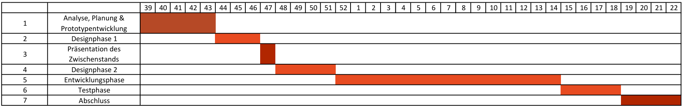

# Projektplan

|Dokumentverantwortlicher|Rolle|
|-|-|
|Yvonne Wagner|Projektleiterin|

## Versionskontrolle

|Version|Datum|Autor|Kommentar|
|-|-|-|-|
|1.0|16.11.2025|Yvonne Wagner|Erstellung des Dokuments|

## Inhaltsverzeichnis

- [Projektplan](#projektplan)
  - [Versionskontrolle](#versionskontrolle)
  - [Inhaltsverzeichnis](#inhaltsverzeichnis)
  - [1. Einführung](#1-einführung)
  - [2. Zeitplan](#2-zeitplan)
    - [Vorgehensmodell - Wasserfallmodell](#vorgehensmodell---wasserfallmodell)
    - [GANTT - Diagramm](#gantt---diagramm)
    - [Aufteilung der Arbeitsstunden](#aufteilung-der-arbeitsstunden)
  - [3. Kommunikationsplan](#3-kommunikationsplan)
  - [4. Risko Minimierung](#4-risko-minimierung)

## 1. Einführung

Dieses Projekt zielt darauf ab, die digitale Zusammenarbeit und Kommunikation in der Industrie durch die Entwicklung einer „Semantic Wikibase“ zu verbessern. Im Folgenden werden die geplanten Schritte und die organisatorischen Rahmenbedingungen dargestellt.

  

## 2. Zeitplan

Der nachfolgende Zeitplan gibt einen strukturierten Überblick über die wichtigsten Meilensteine und Arbeitspakete des Projekts. Er dient als Orientierung für die Planung und Steuerung der einzelnen Projektphasen und ermöglicht eine transparente Nachverfolgung des Fortschritts.

 

### Vorgehensmodell - Wasserfallmodell
Als Grundlage des Vorgehensmodells dient in diesem Projekt das Wasserfallmodell. Da dieses jedoch nur eingeschränkt flexibel ist und zeitliche Puffer in diesem Projekt eine zentrale Rolle spielen, wird eine angepasste, flexiblere Variante des klassischen Wasserfallmodells verwendet. Diese Modifikation ermöglicht es, Meilensteine bei Bedarf nachträglich anzupassen oder deren Abschluss zeitlich zu verschieben.

 

|Phase|Aufgaben|Zeitraum|Meilenstein|
|-|-|-|-|
| Analyse, Planung & Prototypentwicklung | Analyse bestehender Beschreibungen, Projektplanung & Detaildefinition | KW 39 - KW 43 | Abschluss Analyse, Planung &  (KW 43) |
| Designphase 1 | Theoretischer Prototyp fertigen | KW 44 - 46 | Prototypentwicklung (KW 44) |
| Präsentation des Zwischenstands | - | KW 47 | Präsentation (KW 47) |
| Designphase 2 | Ggf. Feedback in Design übernehmen | KW 48 - 51 | Verbessertes Design (KW 51) |
| Entwicklungsphase | Erweiterung API, Implementierung, UI, Entwicklung von Tests für kleinere Module | KW 52 - KW 14 | Prototyp-Erweiterung auf Finales Produkt abgeschlossen (KW 10) |
| Testphase | API- und Systemtests, Bugfixing | KW 15 - KW 18 | Abschluss Tests (KW 16) |
| Abschluss | Dokumentation, Anwenderdokumentation & Abschlusspräsentation | KW 19 - KW 22 | Projektabschluss & Präsentation (KW 22) |

 

### GANTT - Diagramm

 

### Aufteilung der Arbeitsstunden

Jeder der Mitarbeiter muss ein Soll-Stunden-Konto von insgesamt 180 Stunden absolvieren. Dabei sind die Rollen zu gleichen Teilen aufgeteilt, jeweils 90 Stunden für die spezialisierte Rolle und jeweils 90 Stunden als Entwickler.

||Yvonne Wagner|Kristanna Pfeil|Marvin Igrec|Colin Dietschman|Lucrezia Trabalza|Marina Hidalgo Burova|
|-|-|-|-|-|-|-|
|Anforderungsanalyse|5|15|5|5|5|5|
|Organisation & Kommunikation|15|5|5|5|10|10|
|Projektleitung|20|0|0|0|0|0|
|Recherche|5|15|10|15|10|10|
|Dokumentation|15|15|15|10|35|35|
|Systemarchitektur|0|0|0|25|0|0|
|Programmieren|90|90|90|90|90|90|
|Testen|5|5|30|5|5|5|
|Meetings|10|10|10|10|10|10|
|GitHub Management|10|10|10|10|10|10|
|Präsentation|5|5|5|5|5|5|

  

## 3. Kommunikationsplan

Während des Projekts erfolgt ein enger Austausch mit dem Kunden, um Anforderungen und Fortschritte transparent abzustimmen. Zusätzlich arbeiten wir mit der FoP Consult GmbH zusammen, die die notwendige Serverinfrastruktur bereitstellt. Im Team finden regelmäßig Meetings statt, um den Projektfortschritt zu besprechen, Herausforderungen zu besprechen und die Abstimmung zwischen allen Beteiligten sicherzustellen.

  

## 4. Risko Minimierung

Um die identifizierten Risiken, die im Business Case identifiziert wurden, zu minimieren, wird im Projektplan ausreichend Puffer in Arbeitszeit und Budget eingeplant. Regelmäßige Reviews und Abstimmungen mit allen Beteiligten sollen sicherstellen, dass Probleme frühzeitig erkannt und angegangen werden. Die Open-Source-Lösung bietet zahlreiche Erweiterungen, die mögliche Probleme reduzieren und Anforderungen erfüllen können. Die Systemperformance und Skalierbarkeit werden kontinuierlich überwacht und bei Bedarf angepasst. Schnittstellenprobleme und Datenintegrität werden durch Tests und regelmäßige Überprüfungen adressiert. Die Kommunikation im Team wird durch feste Meeting-Termine und klare Verantwortlichkeiten gestärkt. Uneinheitliche Terminologien werden durch eine zentrale Begriffsdefinition und Schulungen reduziert.