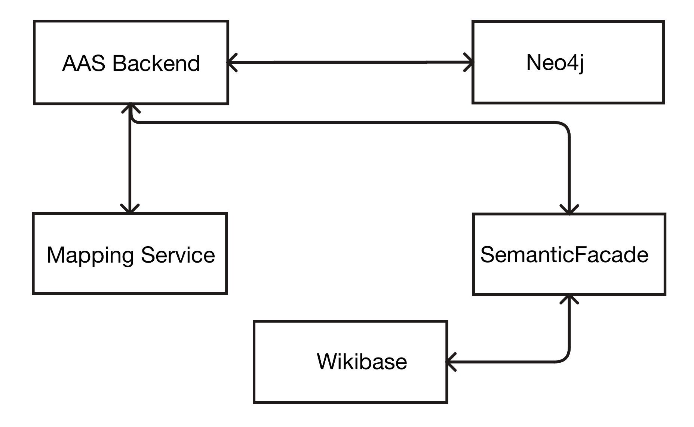

### Software Architecture Specification (SAS) 

## Projekt 4: Semantic Wikibase

Based on IEEE 1471-2000 – Recommended Practice for Architectural Description of Software-Intensive
Systems

Author: Colin Dietschmann
Institution: DHBW Stuttgart

| Version | DATE       | AUTHOR            | KOMMENT |
|-|-|-|-|
| 0.1     | 29.10.2025 | Colin Dietschmann | First draft |
|1.0|08.011.2025|Colin Dietschmann|First Version|
|1.1|13.11.2025| Coln Dietschmann| adjustments of 1.0|
### 1. Overview

# 1.1 Scope:
This Software Archtecture Specification (SAS) describes the architecture of the Semantic Wikibase platform integrated with the existing AAS Cinnect Backend Service.
The combined sysem offers:
- A production/development AAS repository (AAS Connect Backend Service) that exposes REST (OpenAPI) and GraphQL endpoints and also stores AAS artifacts in Neo4j.
- A Semantic Wikibase instance which works as the registry of Concept Descriptions (CDs) using the IEC 61360 inspired data model.
- Integration layers that link AAS submodel elements with resolvable semantic URIs from semantic Wikibase. Mapping and synchronization between Neo4j based AAS data an Wikibase RDF entites.
- Web and programmatic interfaces for AAS clients to retrive language aware IEC61360 JSON representations via a REST facade.

#1.2 Purpose:
The purpose is to define the architectural structure, rationale and components of the semantic Wikibase
pplatform, ensuring reusability and interoperability across AAS systems.

The purpose is to provide a concrete architectural blueprint showing how to adapt the existing AAS Connect repository to:
- Using the Wikibase as the caninical semantix registry for Concept Descriptions (CDs).
- Provide a REST API that returns IEC61360 responses 
- Keep the AAS repository functionality intact and extend it with the semantic referencing and solution.
- Support operational deployment using the provided docker-compose.yml as a baseline.

# 1.3 Intended Users
This specification is intended for:
- **System archtiects** working on the semantic infrastructures and deploying Dockerized services.
- **Developers implementing** working on the AAS Connect Backendand Semantic Wikibase integration.
- **Community contributors** defining or maintianing concept definitons.

# 1.4 Conformance 
This SAS conforms to the IEEE-1471 by providing: AD identification, stakeholders and concerns, selected viewpoints, one or more views per viewpointm rationale and known inconsistencies.

### 2. References
- foprs/aas-connect-repository — GitHub repository (README, docker-compose, Neo4j config).
- IEEE Std 1471-2000.
- IEC 61360 Data Specification (CDD / IEC Common Data Dictionary).
- AAS OpenAPI Specification (IDTA).
- Semantic MediaWiki / Wikibase documentation (Pretty URIs, SPARQL).
- Wikidata / Wikibase REST API docs.
- Catena-X Semantic Hub user guide (for optional federation).

# 3 Definitons

|Term|Definition|
|-   |-         | 
|AAS (Asset Administration Shell)|A standardized digital representation of an asset.|
|Concept Description (CD)|A semantic definiton for submodel elements in a AAS.|
|Wikibase|A MediaWiki-based semantic knowledge base with linked data and versioned entities|
|Semantic Identifier(SID)|A globally resolvable URI that uniquely identifies a concept.|
|REST API|A web interface enabling HTTP-based interaction with system resources.|
|View/Viewpoint|Conceptual representations of system aspects according to IEEE 1471.|
|SemanticHub|Catena-X platform providing a federated semantic reference registry.|

References: IEEE Std 1471-2000 (Basis for this AD); AAS Specification Part 3a: Data Specification – IEC 61360; Wikibase Documentation; OpenAPI Specification.

# 4 onceptual Framework
### 4.1 System Contex
The system consists two subsystems:
1. AAS Repository Subsystem
- Unchanged AAS Connect Backend Service (Nei4j, REST/GraphQL BaSyx UI, Docker compose/Podman)
- Stores AAS artifacts only, no semantic data is persisted here.

2. Semantic Registry Subsystem (Wikibase)
- Stand-alone Wikibase instance (MediaWiki and Wikibase extension)
- Acts as the single source of truth for all Concept Descriptions
- Provides REST and SPARQL APIs for import/export of CD data.
- No duplication of data from AAS repository. The AAS backend queries this service when resolving semantic references.

Integration Layer: 
Semantic API Gateway (Facade) in front of Wikibase:
- Implements AAS-conform endpoints (for example GET /semantic /{id]lang=de)
- Translates between Wikibase RDF model and IEC 61360 JSON used by AAS
- Allows optional POST/PUT for importing or exporting CDs between AAS clients an Wikibase
- No presistant storage, only transforming and routing

External Systems:
- AASX Explorer
- ECLASS/IEC registries
- Catena-X Semantic Hub

### 4.2 Identification of Stakeholders and Concerns

|Stakeholder-Role| Specific Project Role| Core Interest|
|-|-|-|
|User / Acquier (Client) | AAS Tool Users| Needs stable URIs and a compact, machine-readable API response (resolving JSON pain points) for Submodel Elements.|
|User(Operator)| Domain Experts| Requires correct, multilingual definitions and units to ensure data quality and semantic integrity.|
|Developer/User| System Integrators|Requires correct, multilingual definitions and units to ensure data quality and semantic integrity. |
|Acquier/Oversight| Lecturers|Expects a running demo system, conformance to academic standards (Documentation/SAS), and successful project execution. |
|Developer| Student Team| Desires a feasible project with clear requirements and a practical, implementable technical approach using Wikibase.|
|Oversight/Auditor|Data Protection/IT Security Officers| Demands strong access control, data security (especially for the custom REST-Gateway), and compliance with data governance rules.|
| Community/Governance |Community/Open Data Enthusiasts| Wants low barriers to entry for data access and defined governance rules (licensing, contribution guidelines).|

### 4.3 Concerns

- Global resolvability of semantic URIs (Pretty URIs, rewriting).
- API conformance to IEC61360-shaped output and AAS OpenAPI compatibility.
- Data consistency & provenance across Neo4j and Wikibase.
- Low entry barrier: easy UI to publish CDs.
- Scalable deployment using Docker compose and containerization.
- Governance & moderation for community contributions.

### 4.4 Mission 
The mission is to offer an open, community-driven, web-resolvable registriy of semantic Conceüt Descriptions that integrates with the existing AAS Connect repository and supports language-aware IEC61360 ouputs for AAS consumers.

# 5 Architectural Description Practices
## 5.1 Architectural View
### 5.1.1 Structural View (Comonents and Interfaces Componentes)
- AAS Connect Backend (existing)
    - Exposes: REST OpenAPI (/api/v1//*), GraphQL (/graphql/), Swagger UI (/docs/), BaSyx GUI (/gui)
    - Presists to: Neo4j.

- Semantic Wikibase (new)
    - MediaWiki + Wikibase extension
    - Provides SPARQL endpoint and MediaWiki API
    - Stores concept items with unique QIDs (or custom URIs)

- SemanticFacade/API Gateway (new)
    - REST endpoint "GET /semantic/{sid}?lang={lang}" -> returns IEC61360 JSON
    - Translates between Wikibase RDF and IEC61360 JSON template
    - Handles üretty URI rewriting (for example, "https://semantic.example.org/id/Q21"-> internal item).

- Mapping and Sync Service (new)
    - Jobs to: import mappings from IEC/ECLASS where allowed, export AAS submodel references to Wikibase, create/update link entries.

- Authentication/Authorization
    - OAuth2/API tokens for programmatic clients, UI-based login for editors (BaSyx UI credentrials/MediaWiki accounts).
- Presitent Starage
    - Neo4j (AAS data) is existing
    - RDF triple store / Blazegraph (optional) or Wikibase internal storage for semantic triples.

Interfaces:

### 5.1.2 Behavioral View

1. Concept Resolution
- AAS client requests a Submodel referencing a Semantic URI
- AAS Backend calls GET /semantic/{sid}?lang=de on Semantic Facade
- The Facade retrieves data directly from Wikibase (SPARQL/REST) and retrurns an IE0 61360 formated JSON
- No data is stored or synchronized, the AAS Backend uses the response transiently.

2. Import/Export Concept Descriptions
- AAS clients may push new Concept Descriptions vis POST /semantic
- The Facade translates JSON to Wikibase API format an creates/update an item.
- Wikibase remains the single authoritative store for semantic data.

3. Deployment
- The docker-compose stack adds only two new servies: wikibase and semantic-facade
- The existing AAS Backend runs unchanged
- No background synchronization containers are needed

2. Create/Edit Concept
- User who uses Wikibase UI to create a item with properties aligned to IEC61360 fields 
- Admin/curation workflow approves
- Mapping Service optionally syncs approced items into AAS Connect systems as registry entries.

3. Deploy/Start
- Start with docker compose up -d (existing repo), extend docker-compose.yml to include Wikibase, Blazegraph/triplestore and SemanticFacade service.

### 5.1.3 Information View and Data Model (IEC61360)
The information View defines the data sturctures and information flow for Concept Desciptions (CDs) within the system.
This view focuses on how semantic information is modeled, stored and exchanged between the AAS Connect Backend and Semantic Wikibase through the API Facade.

Data Ownership and Storage

- The Wikibase acts as the single source of truth for all semantic concept data.
- The AAS Connect Backend (Neo4j database) does not store semantic metadata (e.g., names, definitions, units).
It only stores semantic references (URIs) that point to Wikibase items.
- The Semantic Facade is stateless and serves only as a translator between AAS and Wikibase representations.

Core Entity: ConceptDescription

Each Concept Description (CD) in the system corresponds to one Wikibase item and follows the IEC 61360 data template.
A CD defines the meaning of an AAS submodel element by describing its semantic attributes.

Attributes (based on IEC 61360):

| Field                       | Description                                                                             |
| --------------------------- | --------------------------------------------------------------------------------------- |
| **id (SID URI)**            | Globally unique identifier for the concept, e.g. `https://semantic.example.org/id/Q21`. |
| **preferredName**           | Multilingual human-readable name (language-tagged literals).                            |
| **definition**              | Multilingual description explaining the concept.                                        |
| **unit**                    | Optional reference to a unit entity (another Wikibase item, e.g. “millimetre”).         |
| **valueFormat**             | Data type or encoding used for values (e.g., `xsd:string`, `xsd:decimal`).              |
| **sourceReference**         | Reference to external standard systems (e.g., IEC CDD, ECLASS IRDI).                    |
| **version**                 | Internal version or revision number of the concept.                                     |
| **createdBy / createdAt**   | Metadata about the concept’s creation.                                                  |
| **modifiedBy / modifiedAt** | Metadata about the last modification.                                                   |
| **externalIdentifiers**     | Optional list of identifiers in external registries (e.g., IEC, ECLASS).                |

Representation Formats
The system supports two main representations for interoperability:
1. IEC 61360 JSON
- Returned by the Semantic Facade’s REST endpoint (GET /semantic/{sid}?lang={lang})
- Structured to be directly consumable by AAS repositories and clients.
- Example output:

{
  "id": "https://semantic.example.org/id/Q21",
  "preferredName": { "en": "diameter", "de": "Durchmesser" },
  "definition": { "en": "Length through the center of a circle", "de": "Länge durch das Zentrum eines Kreises" },
  "unit": { "id": "https://semantic.example.org/id/Q174789", "label": { "en": "millimetre" } },
  "valueFormat": "xsd:decimal",
  "sourceReferences": [
    { "system": "IEC CDD", "id": "0112-2---61360_4#AFD116" }
  ],
  "version": "1.0",
  "provenance": {
    "createdBy": "editor1",
    "createdAt": "2025-10-05T12:00:00Z"
  }
}

2. RDF / Turtle (SPARQL-accessible)
- Used internally by Wikibase and available through its SPARQL endpoint.
- Enables linking to external ontologies such as QUDT, ECLASS, or IEC CDD.

Data Flow
1. Read (AAS → Wikibase)
- An AAS element stores only the semantic reference URI.
- When queried, the AAS Backend sends a request to the Semantic Facade.
- The Facade fetches the corresponding RDF entity from Wikibase and returns it in IEC 61360 JSON format.

2. Write (AAS → Wikibase)
- When a new Concept Description is created in an AAS tool, the AAS client sends it via POST /semantic to the Facade.
- The Facade converts the AAS JSON structure into Wikibase’s API format and creates or updates the item directly in Wikibase.
- The new concept immediately becomes accessible via its URI.

3. Query (External Tools → Wikibase)
- Tools or services can use the Wikibase SPARQL endpoint to query, filter, or federate semantic data.
- The AAS Backend does not replicate or transform this data; it relies entirely on Wikibase for retrieval.

Information Consistency and Provenance
- Single source of truth: Wikibase.
- References only: AAS Connect Backend (Neo4j).
- Transformation only: Semantic Facade (no persistence).
- Provenance and versioning are managed within Wikibase through its built-in revision system.

### 5.1.4 Deployment View: Containers & Topology Baseline (from repo)
- aas-backend container (existing)
- neo4j container (presistent volumes: neo4j/data, neo4j/logs)
- basyx-gui (integrated)

Added components: 
- wikibase container (MediaWiki + Wikibase)
- semantic-facade container (Node.js/Python Flask) for IEC61360 JSON translation.
- sync-service container
- nginx reverse proxy for Pretty URIs and SSL termination (rewrite rules to map /id/Qxxx -> SemanticFacade)

Env configuration: .env (extend .env.sample), new variables for Wikibase DB, SPARQL endpoint, facade configs, admin credentials.

### 5.2

- The structural view defines a SemanticFacade interface that the behavioral flows expect (translation to IEC61360). The information view provides the schema the facade must implement. The deployment view maps each logical component to a container defined in docker-compose.yml extension.

- Known inconsistency: The existing AAS Connect backend may embed semantic references as simple IRDIs or strings; a migration adapter is required to map those to full HTTP SIDs. This adapter is specified in Mapping Service.

### 5.3 Architectural Rationale
- Avoids duplicate data storage: Only Wikibase holds semantic data.
- Lightweight integration: The Semantic Facade API acts as translator, not as repository
- Reduced complexity: No sync, mapping, or consistency managment needed
- Future proof: Other AAS repositories can reuse the same Facade without thight copling.

# 6 Quality Attributes & Requirements
Functional Requierments:
- FR1: Provide GET /semantic/{sid}?lang={lang} returning IEC61360 JSON.
- FR2: POST/PUT/PATCH via Wikibase UI/API for concept creation
- FR3: Provide mapping endpoints to import/export mappings between AAS Backend and Wikibase
- FR4: Expose SPARQL for advanced queries.

Non-Functional Requirments:

- NFR1: API latency < 300ms for cached responses
- NFR2: Persistent storage durability (Neo4j + Wikibase DB volumes).
- NFR3: Scalability via container orchestration (initially docker compose)
- NFR4: Security via OAuth2 for programmatic endpoints and role-based access for edits.

# 7 Implementation Notes (practical steps)

1. Start the existing AAS Connect stack unchanged (docker compose up -d)
2. Add two new containers
- "wikibase" for MediaWiki and Wikibase
- "semantic-facade" for statless REST API

3. Implement Facade API (Node.js/FastAPI)
- Endpoints:
    - GET /semantic/{sid}?lang=de -> returns IEC 61360 JSON
    - POST /semantic -> imports new CDs into Wikibase
- Translates directly to Wikibase SPARQL or REST API calls.
- No presistent storage, no synchronization logic.     

5. Wikibase configuration:
- Create properties for IEC61360 fields (preferred name, definition, unit, value format, IRDI, external IDs).
- Configure pretty URIs and allow rewriting, e.g. https://semantic.example.org/id/Q{item}.

5. Mapping & Sync:
- Script to import AAS submodel templates into Wikibase items (with provenance), and to export Wikibase SIDs into Neo4j as SemanticReference nodes/edges.

6. Testing:
Test with AASX Explorer and BaSyx UI by creating a submodel that references a SID and verifying resolved IEC61360 JSON via the AAS backend.

# 8 Compliance / Acceptance Criteria

SAS is accepted if:
GET /semantics/{sid}?lang={lang} works for sample SID and returns IEC61360 JSON.
AAS Connect Backend can be started unmodified and used together with the added Wikibase stack in docker-compose.
Basic CRUD of concepts through Wikibase UI + created SIDs can be resolved from AAS clients.
Basic mapping script can import at least one submodel template into Wikibase.

# 9 Conclusion

This SAS defines an API-based integration between the existing AAS Connect Backend and a Semantic Wikibase.
The Wikibase becomes the sole registry for Concept Descriptions, accessed via a lightweight REST API Facade that translates between AAS and Wikibase data models.
This eliminates redundant data storage and synchronization, ensuring a clean separation of concerns and straightforward deployment.
