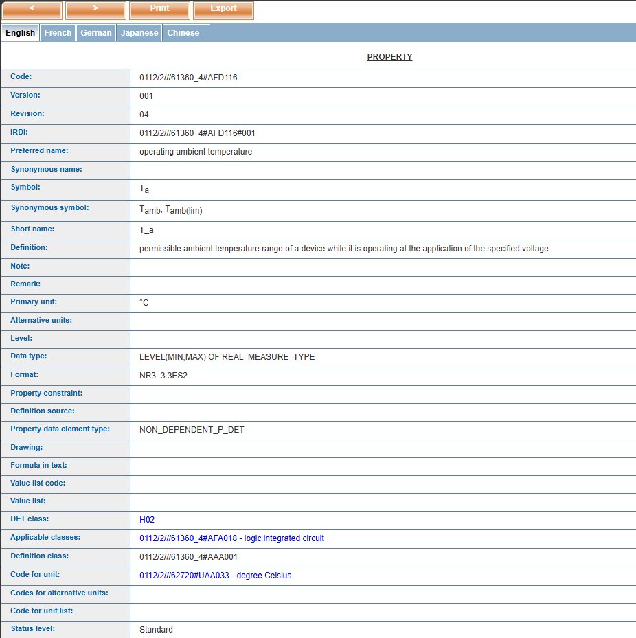
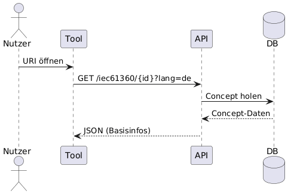
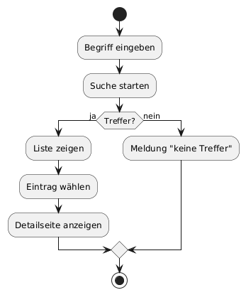
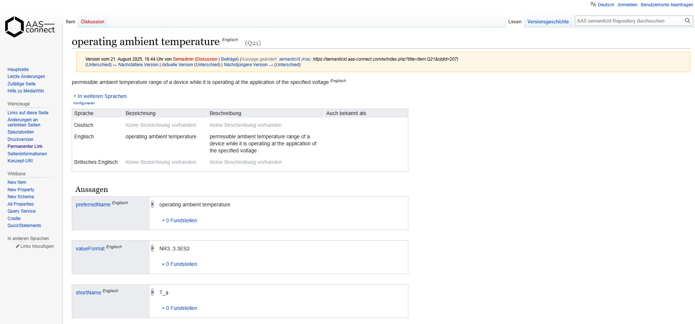
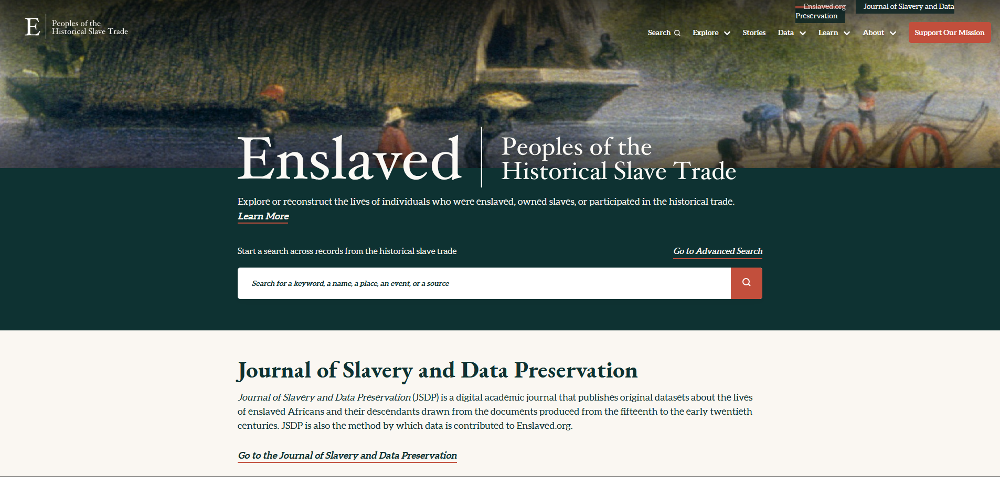
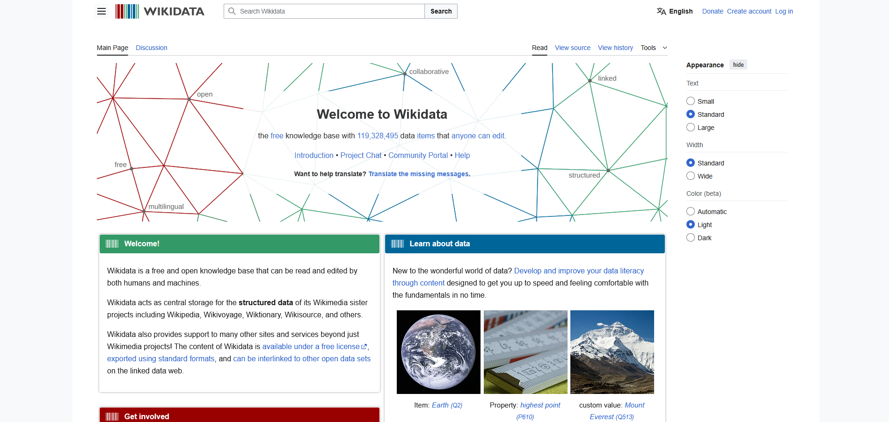

# Pflichtenheft

*Dokumentverantwortlicher: Produktmanager, Kristanna Pfeil*

## Versionskontrolle:

| Version | Datum      | Autor       | Kommentar                         |
|-|-|-|-|
| 1.0     | 16.10.2025 | Kristanna Pfeil | Erstellung & erster Überblick |
| 2.0     | 08.11.2025 | Kristanna Pfeil | Überarbeitung & Finalisierung |
| 3.0     | 12.11.2025 | Kristanna Pfeil | Überarbeitung nach Herr Rentschlers Empfehlung |

 

## Inhaltsverzeichnis

- [Pflichtenheft](#pflichtenheft)
  - [Versionskontrolle:](#versionskontrolle)
  - [Inhaltsverzeichnis](#inhaltsverzeichnis)
  - [1. Einführung in das Pflichtenheft - SRS](#1-einführung-in-das-pflichtenheft---srs)
  - [2. Projektziel](#2-projektziel)
  - [3. Projektübersicht](#3-projektübersicht)
    - [3.1 Product Perspective](#31-product-perspective)
    - [3.2 User Interfaces](#32-user-interfaces)
    - [3.3 Begriffserklärung](#33-begriffserklärung)
    - [3.4 Zielgruppen](#34-zielgruppen)
  - [4. Anwendungsfälle - Use Cases](#4-anwendungsfälle---use-cases)
    - [4.1 Use Case 01 - Auflösende URIs](#41-use-case-01---auflösende-uris)
    - [4.2 Use Case 02 - Suche \& Detailansicht](#42-use-case-02---suche--detailansicht)
    - [4.3 Use Case 03 - REST-Abfrage für AAS](#43-use-case-03---rest-abfrage-für-aas)
    - [4.4 Weitere Use Cases](#44-weitere-use-cases)
  - [5. Anforderungen](#5-anforderungen)
    - [5.1 Funktionale Anforderungen](#51-funktionale-anforderungen)
      - [5.1.1 FA-001 - Auflösbare URIs für Concept Descriptions bereitstellen](#511-fa-001---auflösbare-uris-für-concept-descriptions-bereitstellen)
      - [5.1.2 FA.002 - REST‑API zum Abrufen von Concept Descriptions](#512-fa002---restapi-zum-abrufen-von-concept-descriptions)
      - [5.1.3 FA.003 - Mapping auf IEC61360‑Datentemplate](#513-fa003---mapping-auf-iec61360datentemplate)
      - [5.1.4 FA.004 - REST‑API Sprache](#514-fa004---restapi-sprache)
      - [5.1.5 FA.005 - Edit‑Workflow](#515-fa005---editworkflow)
      - [5.1.6 FA.006 - Verlinkung externen Quellen](#516-fa006---verlinkung-externen-quellen)
      - [5.1.7 FA.007 - Import/Export mit AAS](#517-fa007---importexport-mit-aas)
      - [5.1.8 FA.008 - Leichte Spezifikation \& Governance](#518-fa008---leichte-spezifikation--governance)
      - [5.1.9 FA.009 - Verwaltung und Bereitstellung standardisierbarer Begriffe](#519-fa009---verwaltung-und-bereitstellung-standardisierbarer-begriffe)
      - [5.1.10 FA.010 - Unterstützung der Nutzerführung und Interaktion](#5110-fa010---unterstützung-der-nutzerführung-und-interaktion)
      - [6.1.11 FA.011 - Import und Verarbeitung von AASX-Dateien](#6111-fa011---import-und-verarbeitung-von-aasx-dateien)
      - [6.1.12 FA.012 - Automatisierter Import externer Concept Descriptions per URI](#6112-fa012---automatisierter-import-externer-concept-descriptions-per-uri)
    - [5.2 Nicht-funktionale Anforderungen (NFR)](#52-nicht-funktionale-anforderungen-nfr)
      - [5.2.1  NFA.001 - Verfügbarkeit / Stabilität](#521--nfa001---verfügbarkeit--stabilität)
      - [5.2.2 NFA.002 - Performance](#522-nfa002---performance)
      - [5.2.3 NFA.003 - Sicherheit](#523-nfa003---sicherheit)
      - [5.2.4 NFA.004 - Usability](#524-nfa004---usability)
      - [5.2.5 NFA.005 - Wartbarkeit / Codequalität](#525-nfa005---wartbarkeit--codequalität)
  - [6. Einschränkungen für die Entwickler](#6-einschränkungen-für-die-entwickler)
  - [7. UI](#7-ui)

---

## 1. Einführung in das Pflichtenheft - SRS

Das Pflichtenheft ist ein Dokument, das vom Auftragnehmer auf Basis des Lastenhefts (CRS: https://github.com/DHBW-TINF24F/Team4-Semantic-Wikibase/PROJECT/CRS.md) erstellt wird. Es beschreibt im Detail, wie die im Lastenheft definierten Anforderungen technisch und funktional umgesetzt werden sollen.   
Während das Lastenheft festlegt, was erreicht werden soll, konkretisiert das Pflichtenheft wie dieses Ziel erreicht wird. 
Es soll einen detaillierten Überblick über das Produkt geben, indem Richtlinien und Spezifikationen beschrieben werden. Dadurch wird die Grundlage für das Projekt geschaffen.
Außerdem soll das Dokument als Verbindung zwischen Produktmanagement und Entwicklung dienen.

## 2. Projektziel

Das Ziel des Projekts „Semantic Wikibase“ ist die Entwicklung einer öffentlichen, webbasierten Plattform, die auf Wikibase-Technologie basiert und besonders benutzerfreundlich gestaltet wird.  
Nutzer sollen auf einfache Weise eigene Begriffe und Eigenschaften mit auflösbaren URIs veröffentlichen können, wodurch diese Informationen direkt und unkompliziert für verschiedene Anwendungen und Systeme verfügbar gemacht werden. Die Plattform verfolgt das Ziel, semantische Daten für Unternehmen als auch Privatpersonen zugänglich zu machen und dabei die Hürden existierender, oft komplexer Systeme wie ECLASS oder IEC-CDD zu überwinden. 
Ein besonderer Fokus liegt darauf, die Bedienung intuitiv und den Zugang niedrigschwellig zu halten, damit auch Nutzer ohne tiefgehende technische Kenntnisse die Plattform problemlos nutzen können. Darüber hinaus soll eine REST-API entwickelt werden, die semantische Daten und Definitionen sprachabhängig für verschiedenste Systeme bereitstellt.

## 3. Projektübersicht

### 3.1 Product Perspective

Die Semantic Wikibase ist eine webbasierte Plattform zur Verwaltung, Veröffentlichung und Verknüpfung semantischer Definitionen für die Asset Administration Shell (AAS).
Sie dient als globale Registry für Concept Descriptions und ermöglicht eine semantische Referenzierung über auflösbare URIs, ähnlich wie bei Wikidata oder Wikipedia.

Die Plattform basiert auf der Open-Source-Software Wikibase (https://wikiba.se/) und wird als Webanwendung (Front- und Backend) betrieben.
Die Wikibase-Instanz kann semantische Daten aus existierenden Quellen (z. B. ECLASS, IEC-CDD) übernehmen und durch eine Community gepflegt und erweitert werden.
URIs werden über Server-gestützte Rewrite-Regeln in „Pretty URLs“ transformiert.

Ziel ist es eine Umgebung zu erstellen, die semantische Inhalte verschiedener Quellen integriert und über eine REST-API abrufbar macht.

### 3.2 User Interfaces
Eine UI (User Interface) ist die Benutzeroberfläche eines Programms oder Geräts. Mit der UI interagiert der Benutzer, um es zu bedienen. Dazu gehören zum Beispiel Tasten, Menüs, Icons, Texteingabefelder oder Touchflächen.

Die Benutzeroberfläche soll an die typische Wikibase/Wikipedia-Struktur angelehnt sein und Folgendes ermöglichen:

- Suche & Navigation: Benutzer können semantische Definitionen nach Namen, ID oder Quelle suchen.

- Detailseiten: Jede Concept Description besitzt eine eigene Seite mit Feldern wie preferredName, valueFormat, unit, dataType, definition usw.

- Verlinkungen: Beziehungen zwischen Definitionen werden durch Hyperlinks und Properties dargestellt (z. B. isCaseOf, equivalentClass).

- Mehrsprachigkeit: Inhalte werden in mehreren Sprachen angezeigt (z. B. Deutsch, Englisch).

- Community-Editing: Berechtigte Benutzer können neue Begriffe anlegen oder bestehende bearbeiten.

Ziel ist ein intuitives, wikiähnliches Interface, das von Benutzern ohne technische Vorkenntnisse bedient werden kann.

### 3.3 Begriffserklärung

- **AAS:**
  Die AAS ist sozusagen der digitale Zwilling eines realen Objekts, zum Beispiel einer Maschine, eines Sensors oder auch eines Bauteils.
  Sie beschreibt alle wichtigen Informationen zu diesem Objekt in einer einheitlichen, digitalen Form, die von Menschen und Maschinen verstanden werden kann.
  
  Wie in einer Art digitaler Steckbrief:
  Darin stehen Eigenschaften (z. B. Gewicht, Hersteller, Seriennummer), Funktionen, Zustände oder auch Verknüpfungen zu anderen Objekten.
  
  Das Ziel der AAS ist es dass verschiedene Systeme und Unternehmen über standardisierte Schnittstellen auf dieselben Informationen zugreifen können.

- **IEC 61360:**
  IEC 61360 ist eine internationale Norm, die festlegt, wie technische Merkmale oder Eigenschaften beschrieben werden sollen. Zum Beispiel, wie man „Länge“, „Gewicht“ oder „Spannung“ digital eindeutig definiert.

  Im folgenden Bild ist ein Beispiel eines CD Eintrags nach IEC 61360:

  

- **Concept Description:**
  Eine Concept Description (kurz: CD) ist in der AAS die Beschreibung eines Begriffs oder einer Eigenschaft, die semantische Bedeutung dahinter.

### 3.4 Zielgruppen

- Entwickler und Betreiber von AAS-Systemen
- Fachexperten, die semantsiche Definitionen erstellen
- Unternehmen, die semantische Definitionen verwalten

## 4. Anwendungsfälle - Use Cases

### 4.1 Use Case 01 - Auflösende URIs

| Use Case ID  | UC01 |
|--------------|------|
| Beschreibung | Das AAS-Tool nutzt die URI einer Eigenschaft (z.B. Nennspannung) und erhält direkt alle Basisinformationen maschinenlesbar. |
| Beteiligte Rollen | Nutzer, AAS-Server |
| Systemgrenze | API-Endpunkt/AAS-Server |
| Vorbedingung | Die URI der Eigenschaft ist bekannt. Nutzer hat ein AAS-Modell. |
| Nachbedingung bei Erfolg | Nutzer erhält ein JSON mit allen relevanten Infos zum Konzept. |
| Auslösendes Ereignis | Aufruf der URI über das Tool/API. |

### 4.2 Use Case 02 - Suche & Detailansicht

| Use Case ID  | UC02 |
|--------------|------|
| Beschreibung | Nutzer sucht Konzept und öffnet Detailseite mit Einheit, Datentyp, Quellenlinks etc. |
| Beteiligte Rollen | Nutzer |
| Systemgrenze | Web-UI |
| Vorbedingung | Begriff existiert im System. |
| Nachbedingung bei Erfolg | Detailseite mit allen Infos und Verlinkungen wird angezeigt. |
| Auslösendes Ereignis | Suche und Öffnen eines Concepts. |

### 4.3 Use Case 03 - REST-Abfrage für AAS

| Use Case ID  | UC03 |
|--------------|------|
| Beschreibung | REST-Abfrage für AAS: /api/v1/iec61360/{id}?lang=de. Liefert ein schlankes, sprachabhängiges JSON basierend auf dem IEC-61360-Datentemplate. Wird benötigt, damit AAS-Systeme semantische Definitionen zentral und webbasiert abrufen können, unabhängig von ihrem eigenen lokalen CD-Repository. |
| Beteiligte Rollen | Entwickler, AAS-Systeme |
| Systemgrenze | API |
| Vorbedingung | Ein Concept Description-Eintrag existiert in der Semantic Wikibase und besitzt eine auflösbare URI. |
| Nachbedingung bei Erfolg | Das API liefert ein vollständiges IEC-61360-konformes JSON mit allen relevanten Concept-Informationen in der gewünschten Sprache zurück. |
| Auslösendes Ereignis | Ein AAS-System oder ein Entwickler sendet einen Request an den API-Endpunkt, z. B. um eine Concept Description für ein Submodel-Element aufzulösen. |

### 4.4 Weitere Use Cases

Siehe auch: [Use Case 04 - Quellenverweis - im CRS](CRS.md#44-use-case-04---quellenverweis)

Siehe auch: [Use Case 05 - Pflege der Datensätze - im CRS](CRS.md#45-use-case-05---pflege-der-datensätze)

## 5. Anforderungen

### 5.1 Funktionale Anforderungen

#### 5.1.1 FA-001 - Auflösbare URIs für Concept Descriptions bereitstellen

|Requirement ID|FA.001|
|--------------|------|
|Übersicht|Für jedes Konzept wird eine eindeutige, auflösbare Web-Adresse (URI) bereitgestellt. Beim Aufruf im Browser oder per API wird die jeweilige Beschreibung angezeigt.|
|Erfüllungskriterium|Beim Aufrufen der URI erscheint die  Detailseite (HTML).|

#### 5.1.2 FA.002 - REST‑API zum Abrufen von Concept Descriptions

|Requirement ID|FA.002|
|--------------|------|
|Übersicht|Es wird eine REST-API angeboten, über die Concept Descriptions abgerufen, angelegt, bearbeitet und gelöscht werden können. Die API liefert strukturierte JSON-Daten im IEC 61360 Format.|
|Erfüllungskriterium|Die API deckt alle geforderten Funktionen ab und gibt die Concept Descriptions entsprechend des IEC 61360 Standards als JSON-Objekte aus.|

#### 5.1.3 FA.003 - Mapping auf IEC61360‑Datentemplate

|Requirement ID|FA.003|
|--------------|------|
|Übersicht|Concept Descriptions werden nach dem internationalen IEC 61360 Standard modelliert und enthalten alle zugehörigen Felder (Name, Definition, Datentyp, Einheit, IRDI Identifier).|
|Erfüllungskriterium|Jedes gespeicherte Konzept enthält alle relevanten Felder des IEC 61360 Standards und kann über die Plattform und API abgerufen werden.|

#### 5.1.4 FA.004 - REST‑API Sprache

|Requirement ID|FA.004|
|--------------|------|
|Übersicht|Der REST-API Endpunkt `/api/v1/iec61360/{id}?lang=xx` gibt die geforderten Felder eines Konzepts im kompakten, und in der gewählten Sprache im JSON-Format zurück.|
|Erfüllungskriterium|Das API-JSON entspricht dem im Anhang gezeigten Beispiel und enthält alle konzeptrelevanten Felder, gefiltert nach gewünschter Sprache.|

#### 5.1.5 FA.005 - Edit‑Workflow

|Requirement ID|FA.005|
|--------------|------|
|Übersicht|Die Plattform erlaubt es, neue Concept Descriptions einfach zu erfassen und bestehende zu bearbeiten.|
|Erfüllungskriterium|Nutzer können selbstständig neue Einträge anlegen und vorhandene bearbeiten.|

#### 5.1.6 FA.006 - Verlinkung externen Quellen

|Requirement ID|FA.006|
|--------------|------|
|Übersicht|Die Detailansicht eines Konzepts enthält anklickbare Links zu externen Quellen und Normen (beispielsweise IEC-CDD, ECLASS, QUDT).|
|Erfüllungskriterium|Für referenzierte Concept Descriptions mit externen Beziehungen werden in der Detailansicht klickbare Links angezeigt und führen korrekt zu den externen Quellen.|

#### 5.1.7 FA.007 - Import/Export mit AAS

|Requirement ID|FA.007|
|--------------|------|
|Übersicht|Die Semantic Wikibase ermöglicht den Import und Export von AAS-Daten und ist mit der Asset Administration Shell (AAS) integrierbar (z.B. mit AASX-Dateien).|
|Erfüllungskriterium|AAS-Daten können von Nutzern importiert, verknüpft und im standardisierten Format exportiert werden. Die Daten stehen danach über die Plattform oder API zur Verfügung.|

#### 5.1.8 FA.008 - Leichte Spezifikation & Governance

|Requirement ID|FA.008|
|--------------|------|
|Übersicht|Für die Erstellung und Pflege von Concept Descriptions gelten eindeutige und einfache Mindestvorgaben: Name, Definition, Sprache, Datentyp und Quelle sind verpflichtend.|
|Erfüllungskriterium|Die Plattform stellt bei der Erfassung sicher, dass alle Pflichtfelder ausgefüllt sind, sodass jedes Konzept eindeutig und nachvollziehbar dokumentiert ist.|

#### 5.1.9 FA.009 - Verwaltung und Bereitstellung standardisierbarer Begriffe

|Requirement ID|FA.009|
|--------------|------|
|Übersicht|Die in der Semantic Wikibase gespeicherten Begriffe und Definitionen sollen so aufgebaut und verwaltet werden, dass sie später problemlos auf internationale Standard-Systeme (z. B. IEC-CDD, ECLASS, QUDT) migriert oder automatisch weitergeleitet werden können.|
|Erfüllungskriterium|Jede im Wiki erzeugte URI und die dazugehörige Datenstruktur sind so gestaltet, dass sie mit den Identifiern und Strukturen etablierter Normsysteme kompatibel sind. Bei Migration eines Begriffs in einen offiziellen Standard lässt sich die ursprüngliche Wiki-URI technisch einfach (z. B. per Redirect) zur neuen Standard-URI weiterleiten.

#### 5.1.10 FA.010 - Unterstützung der Nutzerführung und Interaktion

|Requirement ID|FA.010|
|--------------|------|
|Übersicht|Die Plattform muss benutzerfreundlich gestaltet sein, sodass Nutzer direkt verstehen, wie sie die wichtigsten Funktionen verwenden können. Die Bedienung soll intuitiv sein, mit klar strukturierten Oberflächen und selbsterklärenden Elementen.|
|Erfüllungskriterium|Die UI enthält eine verständliche Anleitung und Hinweise für alle wesentlichen Schritte. Pflichtfelder, Buttons und Aktionen sind eindeutig gekennzeichnet. Nutzer gelangen mit möglichst wenigen Klicks zum Ziel und finden alle wichtigen Funktionen schnell und ohne Umwege. Die Oberfläche unterstützt visuelles Feedback (z. B. Bestätigung oder Fehlermeldung), Tooltips oder Hilfetexte.|

#### 6.1.11 FA.011 - Import und Verarbeitung von AASX-Dateien

|Requirement ID|FA.011|
|--------------|------|
|Übersicht|Das System soll eine Funktion bereitstellen, mit der AASX-Dateien importiert und die darin enthaltenen ConceptDescriptions (CDs) sowie EmbeddedDataSpecifications (EDSs) automatisiert erkannt, analysiert und in der Wikibase abgebildet werden.|
|Erfüllungskriterium|Beim Hochladen einer AASX-Datei wird der Inhalt automatisch gescannt. Das System erkennt alle enthaltenen CDs und EDSs, gleicht sie mit bestehenden Einträgen in der Wikibase ab und zeigt dem Nutzer Mapping-Vorschläge an. Für nicht vorhandene Elemente erstellt das System neue Wikibase-Einträge gemäß dem IEC-61360-Datentemplate. Der Importprozess ist abgeschlossen, wenn alle gefundenen Elemente entweder gemappt oder neu angelegt wurden und im System sichtbar sind.|

#### 6.1.12 FA.012 - Automatisierter Import externer Concept Descriptions per URI

|Requirement ID|FA.012|
|--------------|------|
|Übersicht|Das System soll eine Funktion bereitstellen, mit der Nutzer eine externe URI (z. B. zu einem IEC-CDD-, ECLASS- oder anderen semantischen Katalogeintrag) angeben können. Das System ruft die verlinkte Ressource ab, extrahiert automatisch die relevanten Informationen (z. B. Name, Definition, Einheit, Datentyp, Identifier) aus der HTML- oder API-Antwort und überführt diese Daten in das interne IEC-61360-Datenformat der Semantic Wikibase. Falls ein passender Eintrag bereits existiert, wird ein Mapping vorgeschlagen; andernfalls wird ein neuer Concept-Description-Eintrag angelegt.|
|Erfüllungskriterium|Gibt der Nutzer eine gültige externe URI zu einer Concept Description an, wird die Ressource vom System automatisch geladen und analysiert. Das System zeigt dem Nutzer eine Zusammenfassung der erkannten Metadaten sowie Mapping-Vorschläge auf bestehende Konzepte an. Nach Bestätigung durch den Nutzer werden entweder bestehende Einträge verknüpft oder neue IEC-61360-konforme Concept Descriptions in der Wikibase erzeugt. Die importierten Einträge sind anschließend über URI, REST-API und Detailansicht abrufbar.|

### 5.2 Nicht-funktionale Anforderungen (NFR)

#### 5.2.1  NFA.001 - Verfügbarkeit / Stabilität

| Requirement ID      |NFA.001                                                                                        |
|--------------|------|
| Übersicht           | Die Plattform soll für Demonstrationen und Tests zuverlässig verfügbar sein.                   |
| Erfüllungskriterium | Der Dienst ist während der Test- und Demo-Phasen erreichbar und reagiert stabil ohne Abstürze. |

#### 5.2.2 NFA.002 - Performance

| Requirement ID      |NFA.002                                                                                        |
|--------------|------|
| Übersicht           | Die Plattform soll eine angemessene Performance und kurze Antwortzeiten der API gewährleisten.                             |
| Erfüllungskriterium | API-Anfragen werden ohne wahrnehmbare Verzögerungen (z. B. < 2 Sek.) beantwortet, um eine flüssige Nutzung zu ermöglichen. |

#### 5.2.3 NFA.003 - Sicherheit

| Requirement ID      |NFA.003                                                                                        |
|--------------|------|
| Übersicht           | Die Plattform soll sicherstellen, dass nur autorisierte Benutzer Schreibaktionen durchführen können und keine sensiblen Daten öffentlich einsehbar sind. |
| Erfüllungskriterium | Schreibzugriffe sind nur nach Authentifizierung möglich; vertrauliche Daten sind nicht öffentlich zugänglich.                                            |

#### 5.2.4 NFA.004 - Usability

| Requirement ID      |NFA.004                                                                                        |
|--------------|------|
| Übersicht           | Die Benutzeroberfläche soll eine einfache und intuitive Dateneingabe ermöglichen.                            |
| Erfüllungskriterium | Pflichtfelder sind klar markiert, und das Eingabeformular kann ohne technische Vorkenntnisse genutzt werden. |

#### 5.2.5 NFA.005 - Wartbarkeit / Codequalität

| Requirement ID      |NFA.005                                                                                        |
|--------------|------|
| Übersicht           | Der Quellcode soll leicht wartbar, verständlich und dokumentiert sein.                             |
| Erfüllungskriterium | Der Code ist klar strukturiert, enthält ein README und eine nachvollziehbare Deployment-Anleitung. |

## 6. Einschränkungen für die Entwickler

- Die Software muss auf der Open-Source-Plattform Wikibase (MediaWiki + Wikibase Extension) aufbauen.

- Die Datenstruktur und die genutzten Eigenschaften (Properties) müssen zu den Standards IEC 61360 und AAS Concept Descriptions passen, damit alles miteinander kompatibel bleibt.

- Es dürfen nur offene Datenquellen verwendet werden, also solche, die keine rechtlichen Probleme verursachen (z. B. lizenzfreie Definitionen).

- Bei der Performance sollte darauf geachtet werden, dass auch bei größeren Datenmengen (z.B. vielen Concept Descriptions) die Abfragen über SPARQL und REST-API noch schnell funktionieren.

- Die Wikibase muss mehrsprachig aufgebaut sein, damit Nutzer Inhalte z. B. auf Deutsch und Englisch abrufen können.

- Aus Sicherheitsgründen dürfen Bearbeitungen nur von registrierten Benutzern durchgeführt werden.

- Außerdem muss der Server sicher betrieben werden. Also mit HTTPS, aktivem Zugriffsschutz und funktionierendem URI-Rewriting für die schönen URLs.

## 7. UI

Eine mögliche UI könnte wie folgende Plattform "AAS-Connect" aussehen.
Anhand solcher Plattformen werden mögliche UI- und Prozess- Optimierungen erkannt und für dieses Projekt umgesetzt.

Dieses Beispiel zeigt eine alternative Wikibase-Startseite.
Daran lässt sich gut erkennen, dass die UI flexibel anpassbar ist und unterschiedliche Darstellungsformen unterstützt.

Auch Wikidata nutzt eine eigene UI-Gestaltung.
Die Vielfalt der Beispiele verdeutlicht, welche unterschiedlichen Layout- und Interaktionsmöglichkeiten eine Wikibase-basierte Plattform bieten kann.

