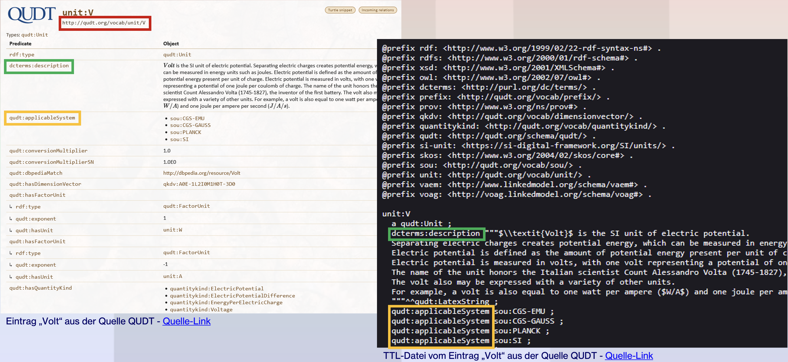
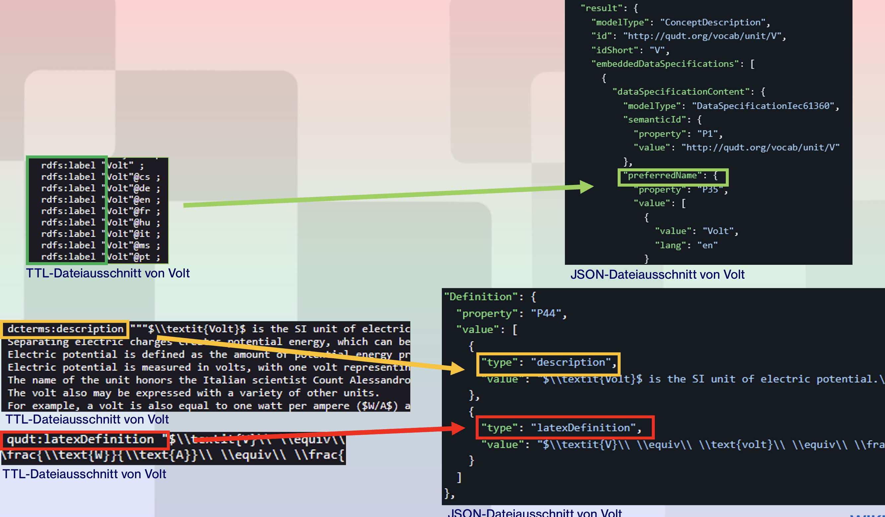
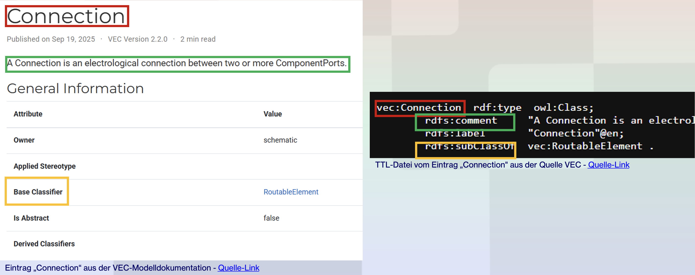
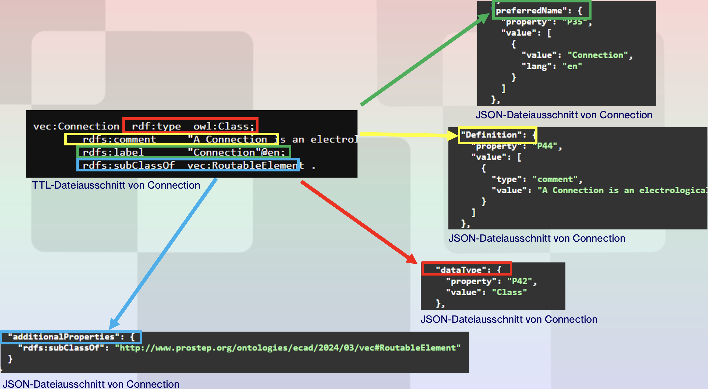
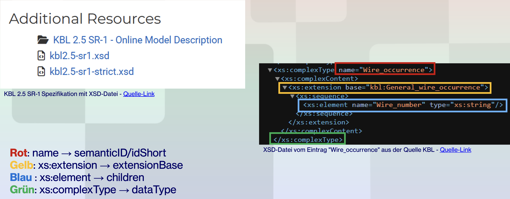
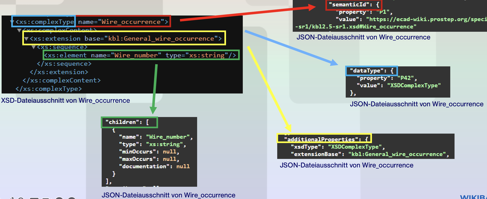
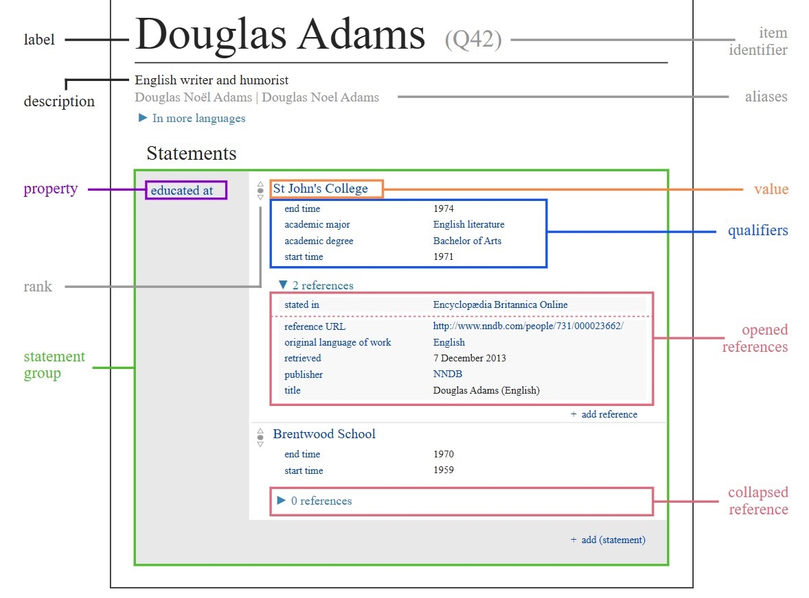

# Moduldokumentation (MOD) 

*Dokumentverantwortliche: Technische Redakteure, Lucrezia Trabalza und Marina Hidalgo Burova*

---

## Versionskontrolle

| Version | Datum | Autor | Kommentar |
|---------|-------|-------|-----------|
| 1.0     | 27.04.2026 | Lucrezia Trabalza | Erstellung & erster Entwurf |
| 1.1     | 12.05.2026 | Lucrezia Trabalza, Marina Hidalgo Burova | Erweiterung der Moduldokumentation um OpenAPI-Spezifikation, Mapping-Zusammenführung, API-Architektur, Datenquellen, Wikibase-Integration, Suchfunktion, Fehlerbehandlung und Tests |
| 1.2     | 14.05.2026 | Lucrezia Trabalza, Marina Hidalgo Burova | Ergänzung der gemeinsamen Mapping-Vergleichstabelle für QUDT, VEC und KBL sowie Erweiterung um Wikibase-Datenstruktur und Abgrenzung zwischen API-Gateway und Einzel-APIs |

---

## Inhaltsverzeichnis

- [1. OpenAPI Spezifikation](#1-openapi-spezifikation)
  - [1.1 Ziel](#11-ziel)
  - [1.2 Funktionsweise der API](#12-funktionsweise-der-api)
  - [1.3 Beispiel-Endpunkt](#13-beispiel-endpunkt)
  - [1.4 Beispiel-Anfrage](#14-beispiel-anfrage)
  - [1.5 Beispiel-Antwort](#15-beispiel-antwort)
- [2. Zusammenführung der Mappings](#2-zusammenführung-der-mappings)
  - [2.1 Ziel](#21-ziel)
  - [2.2 Datenquellen](#22-datenquellen)
  - [2.3 Gemeinsames Zielmodell](#23-gemeinsames-zielmodell)
  - [2.4 Mapping-Regeln](#24-mapping-regeln)
  - [2.5 Zusammenführung der Einzelmappings](#25-zusammenführung-der-einzelmappings)
  - [2.6 Ergebnis](#26-ergebnis)
- [3. Architektur der API](#3-architektur-der-api)
  - [3.1 Überblick](#31-überblick)
  - [3.2 Abgrenzung zwischen API-Gateway und Einzel-APIs](#32-abgrenzung-zwischen-api-gateway-und-einzel-apis)
- [4. Datenquellen und Mappings](#4-datenquellen-und-mappings)
  - [4.1 QUDT](#41-qudt)
  - [4.2 VEC](#42-vec)
  - [4.3 KBL](#43-kbl)
- [5. Gemeinsames Mapping über alle Quellen](#5-gemeinsames-mapping-über-alle-quellen)
- [6. Gemeinsames Zielmodell](#6-gemeinsames-zielmodell)
- [7. Wikibase-Datenstruktur und Ablage der gemappten Informationen](#7-wikibase-datenstruktur-und-ablage-der-gemappten-informationen)
- [8. Mapping-Prozess](#8-mapping-prozess)
- [9. Wikibase-Integration](#9-wikibase-integration)
- [10. Suchfunktion und SemanticId-Suche](#10-suchfunktion-und-semanticid-suche)
- [11. Fehlerbehandlung](#11-fehlerbehandlung)
- [12. Tests der Module](#12-tests-der-module)
- [13. Ergebnis und Ausblick](#13-ergebnis-und-ausblick)

---

## 1. OpenAPI Spezifikation

### 1.1 Ziel 

Ziel der OpenAPI-Spezifikation ist die standardisierte Beschreibung der REST-API der Semantic Wikibase.
Dadurch wird sichergestellt, dass externe Systeme (z. B. AAS-Clients) die API eindeutig verstehen und nutzen können.

---

### 1.2 Funktionsweise der API

Die API stellt semantische Definitionen (Concept Descriptions) auf Basis einer eindeutigen semantischen ID (SID) bereit.

Ein Client kann über eine HTTP-Anfrage eine Concept Description abrufen und erhält eine strukturierte Antwort im IEC 61360-ähnlichen JSON-Format.

---

### 1.3 Beispiel-Endpunkt

Die Semantic Wikibase stellt verschiedene REST-Endpunkte zur Verfügung. Für die Suche nach semantischen Definitionen wird ein API-Endpunkt verwendet, der Suchbegriff, Sprache und Typfilter entgegennehmen kann.

Beispiel eines Such-Endpunkts:

```http
GET /api/v3/search?search=Volt&lang=de&types=unit
```
Zusätzlich existieren bzw. sind folgende Endpunkte vorgesehen:
- Suche nach semantischen Definitionen
- Suche nach Semantic IDs
- Abruf einzelner Concept Descriptions
- Import und Export von Semantic IDs
- Mapping externer Datenquellen auf das IEC61360-Datenmodell

---

### 1.4 Beispiel-Anfrage

Beispiel einer HTTP-Anfrage:

```http
GET /api/v3/search?search=Volt&lang=de&types=unit
Host: semantic-hub.io
Accept: application/json
```
Die Anfrage sucht nach der semantischen Definition der Einheit „Volt“ in deutscher Sprache.

---

### 1.5 Beispiel-Antwort
Die API liefert die Daten im IEC61360-ähnlichen JSON-Format zurück.

Beispiel:

```json
{
  "modelType": "ConceptDescription",
  "id": "http://qudt.org/vocab/unit/V",
  "idShort": "V",
  "preferredName": "Volt",
  "symbol": "V",
  "dataType": "Unit",
  "definition": "Electric potential unit",
  "source": "QUDT"
}
```
Die Antwort enthält die wichtigsten semantischen Eigenschaften der jeweiligen Concept Description.

---

## 2. Zusammenführung der Mappings 

### 2.1 Ziel 

Ziel ist die Vereinheitlichung aller von den Gruppenmitgliedern erstellten Mappings in eine gemeinsame Struktur.

Dadurch wird sichergestellt, dass:
- alle Datenquellen konsistent verarbeitet werden
- die API ein einheitliches Ausgabeformat liefert
- die Daten in Wikibase einheitlich gespeichert werden

---

### 2.2 Datenquellen

Die Mappings basieren auf verschiedenen externen Quellen:
- QUDT
- VEC
- KBL

---

### 2.3 Gemeinsames Zielmodell

Alle externen Datenquellen werden in ein gemeinsames Zielmodell überführt.

Dadurch wird sichergestellt, dass:
- unterschiedliche Ontologien einheitlich verarbeitet werden können
- die REST-API ein konsistentes Ausgabeformat liefert
- Daten standardisiert in Wikibase gespeichert bzw. bereitgestellt werden

Das Zielmodell orientiert sich am IEC61360-Datentemplate der Asset Administration Shell.

Beispielstruktur:
```json
{
  "modelType": "ConceptDescription",
  "id": "http://qudt.org/vocab/unit/V",
  "idShort": "V",
  "preferredName": "Volt",
  "symbol": "V",
  "dataType": "Unit",
  "definition": "Electric potential unit",
  "source": "QUDT"
}
```

---

### 2.4 Mapping-Regeln

Die verschiedenen externen Datenquellen besitzen unterschiedliche Datenstrukturen und Formate.

Damit die Daten gemeinsam verarbeitet werden können, werden Mapping-Regeln definiert.

Dabei werden:
- RDF-Properties
- XML/XSD-Elemente
- Ontologie-Klassen
- sowie externe Attribute

auf ein gemeinsames IEC61360-kompatibles Datenmodell abgebildet.

Beispiele:
- `rdfs:label` → `preferredName`
- `qudt:symbol` → `symbol`
- `rdf:type` → `dataType`
- `dcterms:description` → `definition`
- URI bzw. Semantic ID → `id`
- lokaler URI-Name → `idShort`

Nicht direkt zuordenbare Eigenschaften werden nicht verworfen, sondern als zusätzliche Properties gespeichert oder für spätere Erweiterungen vorgesehen.

---

### 2.5 Zusammenführung der Einzelmappings

Die einzelnen Mapping-Module wurden unabhängig voneinander entwickelt und anschließend in eine gemeinsame Struktur integriert.

Dabei wurden:
- ein gemeinsames JSON-Zielmodell definiert
- gemeinsame Property-Namen festgelegt
- unterschiedliche Datentypen vereinheitlicht
- sowie ein konsistentes IEC61360-Format erstellt

Die Zusammenführung ermöglicht die gemeinsame Nutzung der Datenquellen innerhalb der Semantic Wikibase.

---

### 2.6 Ergebnis

Durch die Zusammenführung der verschiedenen Mappings konnte eine gemeinsame semantische Plattform aufgebaut werden.

Die Semantic Wikibase kann dadurch:
- Daten aus unterschiedlichen Quellen verarbeiten
- semantische Definitionen standardisiert bereitstellen
- sowie Concept Descriptions über REST-Endpunkte ausgeben.

Die entwickelte Struktur bildet die Grundlage für zukünftige Erweiterungen und zusätzliche Ontologien.

---

## 3. Architektur der API

### 3.1 Überblick

Die Semantic Wikibase verwendet eine REST-basierte API-Architektur zur Bereitstellung semantischer Definitionen.

Die API dient als Vermittlungsschicht zwischen:
- externen Datenquellen (QUDT, VEC, KBL)
- der Wikibase
- und externen Clients wie AAS-Systemen oder dem AASX-Explorer

Die Kommunikation erfolgt über HTTP-Endpunkte.
Die Antworten werden als JSON im IEC61360-ähnlichen Format zurückgegeben.

Die Architektur besteht aus folgenden Komponenten:
- API-Schicht (FastAPI / Flask)
- Mapping-Schicht
- Wikibase
- externe semantische Datenquellen

---

### 3.2 Abgrenzung zwischen API-Gateway und Einzel-APIs

Die API-Struktur ist in zwei Ebenen aufgeteilt:

1. **Zentrale Gateway-API**
2. **Einzelne APIs und Mapper für QUDT, VEC und KBL**

Die zentrale Gateway-API dient als übergeordnete Schnittstelle für externe Clients. Sie nimmt Anfragen entgegen und leitet diese abhängig von Suchbegriff, Quelle oder Typfilter an die passende Einzel-API weiter. Dadurch müssen externe Systeme nicht direkt wissen, ob die Daten aus QUDT, VEC oder KBL stammen.

Die Einzel-APIs und Mapper übernehmen dagegen die konkrete Verarbeitung der jeweiligen Datenquelle. Sie lesen RDF-, TTL- oder XML/XSD-Daten aus, extrahieren relevante Eigenschaften und transformieren diese in das gemeinsame IEC61360-nahe Zielmodell.

Damit ergibt sich folgende Aufgabenverteilung:

| Ebene | Aufgabe | Beschreibung |
|---|---|---|
| API-Gateway | Zentrale Vermittlung | Nimmt externe Anfragen entgegen und ruft die passende Einzel-API auf. |
| QUDT-API / QUDT-Mapper | Verarbeitung von QUDT-Daten | Sucht und mappt physikalische Einheiten, Größen und Symbole aus QUDT. |
| VEC-API / VEC-Mapper | Verarbeitung von VEC-Daten | Verarbeitet RDF-/OWL-Konzepte aus der VEC-Ontologie. |
| KBL-API / KBL-Mapper | Verarbeitung von KBL-Daten | Verarbeitet XML/XSD-Strukturen aus der KBL-Spezifikation. |
| Gemeinsames Zielmodell | Einheitliche Ausgabe | Stellt sicher, dass alle Quellen im gleichen JSON-Format ausgegeben werden. |

Durch diese Trennung bleibt die Gesamtarchitektur erweiterbar. Weitere Datenquellen können später ergänzt werden, ohne dass das grundlegende API-Gateway neu aufgebaut werden muss.

---

## 4. Datenquellen und Mappings

### 4.1 QUDT

QUDT (Quantities, Units, Dimensions and Types) dient als Quelle für physikalische Einheiten und Größen.

Die Daten werden über:
- SPARQL-Abfragen
- RDF/Turtle-Dateien
- sowie REST-Zugriffe

abgerufen.

Die QUDT-Daten werden anschließend auf das IEC61360-Datenmodell gemappt.
Dabei werden unter anderem folgende Eigenschaften übernommen:
- Symbol
- Label
- Beschreibung
- Einheit
- Datentyp
- SI-Ausdruck
- QuantityKind

Nicht alle IEC61360-Properties können direkt aus QUDT befüllt werden, weshalb einige Felder standardmäßig auf null gesetzt werden. Das dient zunächst dazu, eine einheitliche und vollständig IEC61360-konforme Datenstruktur bereitzustellen, sodass alle erzeugten ConceptDescriptions denselben Aufbau besitzen. Zusätzlich existieren für manche IEC61360-Felder keine direkten semantischen Entsprechungen im QUDT-Datenmodell, beispielsweise für levelType, valueList oder value. Andere Felder könnten zwar theoretisch abgeleitet werden, sind im aktuellen Stand jedoch noch nicht implementiert. Durch das explizite Setzen auf null wird außerdem eindeutig gekennzeichnet, dass für diese Properties momentan kein Wert vorhanden ist.

Zur besseren Nachvollziehbarkeit des QUDT-Mappings zeigen die folgenden visuellen Beispiele, welche RDF-/TTL-Rohdaten aus der Quelle entnommen werden und wie diese anschließend in die JSON-Struktur der Concept Description übertragen werden.



*Abbildung: Ausschnitt der QUDT-Rohdaten am Beispiel „Volt“. Sichtbar sind unter anderem RDF-/TTL-Eigenschaften wie `dcterms:description`, `qudt:applicableSystem` und die Semantic-ID des Eintrags.*



*Abbildung: Ergebnis des QUDT-Mappings als JSON-Ausschnitt. Die farbigen Markierungen und Pfeile zeigen beispielhaft, wie RDF-Properties wie `rdfs:label`, `dcterms:description` und `qudt:latexDefinition` in die entsprechenden JSON-Felder übertragen werden.*

Die folgende Tabelle zeigt, welche QUDT-Properties im aktuellen Mapping berücksichtigt werden und wie sie auf die Felder des gemeinsamen Zielmodells abgebildet werden.

| QUDT / RDF Property | Quelle im Code | IEC61360 Feld | SemanticHub Property-Nr. | Mapping-Logik | Warum ggf. `null` |
|---|---|---|---|---|---|
| Entity URI | `entity_uri` | `semanticId` | `P1` | Die gefundene QUDT-URI wird direkt als Semantic ID übernommen. | Niemals `null`, da immer aus dem Treffer erzeugt. |
| URI-Ende | `local_name(uri)` | `idShort` | — | Der letzte Teil der URI wird als `idShort` verwendet. | Nur `null`, wenn URI ungültig wäre. |
| `rdfs:label` | `http://www.w3.org/2000/01/rdf-schema#label` | `preferredName` | `P35` | Label in gewählter Sprache, sonst Englisch als Fallback. | Falls kein passendes Label existiert, wird am Ende explizit `null` gesetzt. |
| Kein direktes Mapping | — | `shortName` | `P36` | Im aktuellen Code nicht gemappt. | Standardmäßig `null`, da QUDT keine eindeutige Kurzbezeichnung liefert oder das Mapping noch nicht implementiert wurde. |
| `rdfs:label` | `http://www.w3.org/2000/01/rdf-schema#label` | `unit` | `P37` | Das Label wird zusätzlich als Unit gesetzt, wenn noch keine Unit vorhanden ist. | Bleibt `null`, wenn kein passendes Label gefunden wird. |
| `rdfs:isDefinedBy` | `http://www.w3.org/2000/01/rdf-schema#isDefinedBy` | `sourceOfDefinition` | `P40` | Wird als Quelle der Definition gespeichert. | Falls keine Definitionsquelle existiert, wird am Ende `null` gesetzt. |
| `qudt:informativeReference` | `http://qudt.org/schema/qudt/informativeReference` | `sourceOfDefinition` | `P40` | Wird ebenfalls als Definitionsquelle gespeichert. | Falls keine Referenzen vorhanden sind. |
| `qudt:symbol` | `http://qudt.org/schema/qudt/symbol` | `Symbol` | `P41` | Symbol wird übernommen, z. B. `V` bei Volt. | Bleibt `null`, wenn kein Symbol existiert. |
| `rdf:type` | `http://www.w3.org/1999/02/22-rdf-syntax-ns#type` | `dataType` | `P42` | Der QUDT-Typ wird als Datentyp gespeichert. | Bleibt `null`, wenn kein Typ gefunden wird. |
| `qudt:iec61360Code` | `http://qudt.org/schema/qudt/iec61360Code` | `unitId` | `P43` | IEC61360-Code wird als Unit-ID übernommen. | Bleibt `null`, wenn QUDT keinen IEC61360-Code enthält. |
| `dcterms:description` | `http://purl.org/dc/terms/description` | `Definition` | `P44` | Beschreibung wird als Definition mit Typ `description` gespeichert. | Falls keine Beschreibung existiert, wird am Ende `null` gesetzt. |
| `qudt:latexDefinition` | `http://qudt.org/schema/qudt/latexDefinition` | `Definition` | `P44` | LaTeX-Definition wird zusätzlich als Definition gespeichert. | Falls keine LaTeX-Definition existiert. |
| `qudt:siUnitsExpression` | `http://qudt.org/schema/qudt/siUnitsExpression` | `valueFormat` | `P45` | SI-Einheiten-Ausdruck wird als Value Format gespeichert. | Bleibt `null`, wenn keine SI-Expression vorhanden ist. |
| Kein Mapping im Code | — | `valueList` | `P46` | Im aktuellen Code nicht implementiert. | Standardmäßig `null`, da QUDT hierfür meist keine passenden Enumerationen liefert. |
| Kein Mapping im Code | — | `value` | `P47` | Im aktuellen Code nicht implementiert. | Standardmäßig `null`, da keine konkreten Instanzwerte aus QUDT übernommen werden. |
| Kein Mapping im Code | — | `levelType` | `P48` | Im aktuellen Code nicht implementiert. | Standardmäßig `null`, da QUDT keine direkte Entsprechung für IEC61360 `levelType` besitzt. |

---

### 4.2 VEC

Die VEC-Ontologie (Vehicle Electric Container) wird verwendet, um semantische Fahrzeug- und Kabelbaumdaten bereitzustellen.

Die Ontologie liegt als RDF/TTL-Modell vor und wird über Python-Mapper verarbeitet.

Die Daten werden analysiert und anschließend in das gemeinsame IEC61360-Zielmodell überführt.

Zur besseren Nachvollziehbarkeit des VEC-Mappings zeigen die folgenden visuellen Beispiele den Weg von den RDF-/TTL-Rohdaten aus der VEC-Ontologie zur erzeugten JSON-Struktur.



*Abbildung: Ausschnitt der VEC-Rohdaten am Beispiel „Connection“. Sichtbar sind unter anderem der Eintrag aus der VEC-Modelldokumentation sowie der zugehörige TTL-Ausschnitt mit `rdf:type`, `rdfs:comment`, `rdfs:label` und `rdfs:subClassOf`.*



*Abbildung: Ergebnis des VEC-Mappings als JSON-Ausschnitt. Die farbigen Markierungen und Pfeile zeigen beispielhaft, wie VEC-Eigenschaften auf Felder wie `preferredName`, `Definition`, `dataType` und `additionalProperties` übertragen werden.*

Die folgende Tabelle zeigt, welche VEC-Properties im aktuellen Mapping berücksichtigt werden und wie sie auf die Felder des gemeinsamen Zielmodells abgebildet werden.

| VEC / RDF Property | Quelle im Code | IEC61360 Feld | SemanticHub Property-Nr. | Mapping-Logik | Warum ggf. `null` |
|---|---|---|---|---|---|
| Entity URI | `entity_uri` | `semanticId` | `P1` | Die gefundene VEC-URI wird direkt als Semantic ID übernommen. | Niemals `null`, da sie aus dem gefundenen Treffer erzeugt wird. |
| URI-Ende | `local_name(uri)` | `idShort` | — | Der letzte Teil der URI wird als `idShort` verwendet. | Nur `null`, wenn die URI ungültig oder leer wäre. |
| URI-Ende | `local_name(uri)` | `shortName` | `P36` | Der lokale Name der URI wird zusätzlich als Kurzname gesetzt. | Nur `null`, wenn kein lokaler URI-Name extrahiert werden kann. |
| `rdfs:label` | `http://www.w3.org/2000/01/rdf-schema#label` | `preferredName` | `P35` | Labels werden übernommen, wenn sie zur gewählten Sprache, Englisch oder keiner Sprache gehören. | Falls kein passendes Label existiert, wird `preferredName` am Ende auf `null` gesetzt. |
| Kein direktes Mapping | — | `unit` | `P37` | Im aktuellen VEC-Mapping nicht befüllt. | Standardmäßig `null`, da VEC-Konzepte nicht zwingend physikalische Einheiten beschreiben. |
| `rdfs:isDefinedBy` | `http://www.w3.org/2000/01/rdf-schema#isDefinedBy` | `sourceOfDefinition` | `P40` | Die Definitionsquelle wird direkt übernommen. | Falls keine Quelle vorhanden ist, wird als Fallback die VEC-TTL-URL als `ontologySource` gesetzt. |
| `owl:versionInfo` | `http://www.w3.org/2002/07/owl#versionInfo` | `sourceOfDefinition` | `P40` | Versionsinformationen werden zusätzlich als Quelle mit Typ `versionInfo` gespeichert. | Nur `null` bzw. Fallback, wenn keine Versionsinfo und keine andere Quelle vorhanden ist. |
| Kein direktes Mapping | — | `Symbol` | `P41` | Im aktuellen Code nicht gemappt. | Standardmäßig `null`, da VEC hierfür keine einheitliche Symbol-Property im Mapping nutzt. |
| `rdf:type` | `http://www.w3.org/1999/02/22-rdf-syntax-ns#type` | `dataType` | `P42` | RDF-/OWL-Typen werden als Datentyp übernommen. Für `Class`, `ObjectProperty` und `DatatypeProperty` wird der lokale Typname gespeichert. | Bleibt `null`, wenn kein RDF-Typ gefunden wird. |
| Kein direktes Mapping | — | `unitId` | `P43` | Im aktuellen Code nicht implementiert. | Standardmäßig `null`, da VEC keine direkte IEC61360-Unit-ID liefert. |
| `rdfs:comment` | `http://www.w3.org/2000/01/rdf-schema#comment` | `Definition` | `P44` | Kommentare werden als Definition mit Typ `comment` übernommen. | Falls kein passender Kommentar existiert, wird `Definition` am Ende auf `null` gesetzt. |
| Kein direktes Mapping | — | `valueFormat` | `P45` | Im aktuellen Code nicht implementiert. | Standardmäßig `null`, da aus VEC aktuell kein Werteformat abgeleitet wird. |
| Kein direktes Mapping | — | `valueList` | `P46` | Im aktuellen Code nicht implementiert. | Standardmäßig `null`, da VEC im aktuellen Mapping keine Enumerationen in dieses Feld überführt. |
| Kein direktes Mapping | — | `value` | `P47` | Im aktuellen Code nicht implementiert. | Standardmäßig `null`, da keine konkreten Instanzwerte aus VEC übernommen werden. |
| Kein direktes Mapping | — | `levelType` | `P48` | Im aktuellen Code nicht implementiert. | Standardmäßig `null`, da VEC keine direkte Entsprechung für IEC61360 `levelType` besitzt. |
| Sonstige RDF-Properties | z. B. `rdfs:domain`, `rdfs:range`, `rdfs:subClassOf` oder weitere Properties | `additionalProperties` | — | Nicht direkt gemappte RDF-Properties werden gesammelt und zusätzlich ausgegeben. | Nicht `null`, wenn solche zusätzlichen Properties im VEC-Treffer vorhanden sind. |

---

### 4.3 KBL

KBL (Kabelbaumliste) basiert auf XML/XSD-Strukturen und beschreibt Kabelbaumdaten.

Die Daten werden über eigene Mapping-Module eingelesen und analysiert.

Anschließend erfolgt die Überführung der Inhalte in das standardisierte JSON-Zielmodell der Semantic Wikibase.

Zur besseren Nachvollziehbarkeit des KBL-Mappings zeigen die folgenden visuellen Beispiele, wie XML-Schema-Elemente in das gemeinsame JSON-Zielmodell übertragen werden. Da KBL nicht als RDF-/TTL-Ontologie, sondern als XSD-Struktur vorliegt, unterscheidet sich die Ausgangsstruktur von QUDT und VEC.



*Abbildung: Ausschnitt der KBL-XSD-Rohdaten am Beispiel „Wire_occurrence“. Sichtbar sind unter anderem `xs:complexType`, `xs:extension` und `xs:element`, die für die spätere JSON-Struktur ausgewertet werden.*



*Abbildung: Ergebnis des KBL-Mappings als JSON-Ausschnitt. Die farbigen Markierungen und Pfeile zeigen beispielhaft, wie XSD-Bestandteile auf Felder wie `semanticId`, `dataType`, `children` und `additionalProperties` abgebildet werden.*

Die folgende Tabelle zeigt, wie XSD-Elemente, Typen, Attribute und Dokumentationen aus KBL auf die Felder des gemeinsamen Zielmodells abgebildet werden.

| KBL / XSD Property | Quelle im Code | IEC61360 Feld | SemanticHub Property-Nr. | Mapping-Logik | Warum ggf. `null` |
|---|---|---|---|---|---|
| XSD-URL + Name | `f"{KBL_XSD_URL}#{identifier}"` | `semanticId` | `P1` | Aus der KBL-XSD-URL und dem gefundenen XSD-Namen wird eine eindeutige Semantic ID erzeugt. | Niemals `null`, sofern das gefundene XSD-Element einen Namen besitzt. |
| `name`-Attribut | `elem.get("name")` | `idShort` | — | Der Name des XSD-Elements, ComplexType oder SimpleType wird als `idShort` verwendet. | Nur `null`, wenn das XSD-Element keinen Namen besitzt. Dann wird ein Fehler ausgelöst. |
| `name`-Attribut | `elem.get("name")` | `preferredName` | `P35` | Der XSD-Name wird als bevorzugter Name in der gewählten Sprache übernommen. | Nicht `null`, sofern ein Name vorhanden ist. |
| `name`-Attribut | `elem.get("name")` | `shortName` | `P36` | Der XSD-Name wird zusätzlich als Kurzname verwendet. | Nicht `null`, sofern ein Name vorhanden ist. |
| Kein direktes Mapping | — | `unit` | `P37` | Im aktuellen KBL-Mapping nicht befüllt. | Standardmäßig `null`, da aus der XSD keine einheitliche Einheit abgeleitet wird. |
| KBL-XSD-URL | `KBL_XSD_URL` | `sourceOfDefinition` | `P40` | Die XSD-Datei wird als Quelle mit Typ `xsdSource` gespeichert. | Nicht `null`, da die Quelle fest im Code definiert ist. |
| Kein direktes Mapping | — | `Symbol` | `P41` | Im aktuellen Code nicht implementiert. | Standardmäßig `null`, da KBL-XSD-Strukturen keine direkte Symbol-Property liefern. |
| XSD-Elementtyp | `detect_xsd_type(elem)` | `dataType` | `P42` | Der XML-Schema-Typ wird als Datentyp übernommen, z. B. `XSDComplexType`, `XSDSimpleType` oder `XSDElement`. | Nicht `null`, sofern das Element erkannt wird. |
| Kein direktes Mapping | — | `unitId` | `P43` | Im aktuellen Code nicht implementiert. | Standardmäßig `null`, da KBL keine direkte IEC61360-Unit-ID liefert. |
| `xs:documentation` | `elem.find(".//xs:documentation", XS_NS)` | `Definition` | `P44` | Dokumentation aus dem XSD wird als Definition mit Typ `documentation` übernommen. | Falls keine Dokumentation vorhanden ist, wird automatisch eine generierte Definition erzeugt. |
| Generierte Beschreibung | `generatedDefinition` | `Definition` | `P44` | Wenn keine `xs:documentation` existiert, erzeugt der Code eine Ersatzdefinition wie: `Name is defined in the KBL 2.5 SR-1 XML schema as XSDType.` | Nicht `null`, da bei fehlender Dokumentation ein Fallback erzeugt wird. |
| Kein direktes Mapping | — | `valueFormat` | `P45` | Im aktuellen Code nicht implementiert. | Standardmäßig `null`, da kein Werteformat aus der XSD abgeleitet wird. |
| `xs:enumeration` | `.//xs:enumeration` | `valueList` | `P46` | Enumerationswerte werden gesammelt und als Werteliste übernommen. | Bleibt `null`, wenn der XSD-Typ keine Enumerationen enthält. |
| Kein direktes Mapping | — | `value` | `P47` | Im aktuellen Code nicht implementiert. | Standardmäßig `null`, da KBL-XSD keine konkreten Instanzwerte enthält. |
| Kein direktes Mapping | — | `levelType` | `P48` | Im aktuellen Code nicht implementiert. | Standardmäßig `null`, da KBL keine direkte Entsprechung für IEC61360 `levelType` besitzt. |
| Kind-Elemente | `.//xs:element` | `additionalProperties.children` | — | Enthaltene XSD-Elemente werden mit Name, Typ, minOccurs, maxOccurs und Dokumentation gespeichert. | Leere Liste, wenn keine Kind-Elemente vorhanden sind. |
| Attribute | `.//xs:attribute` | `additionalProperties.attributes` | — | XSD-Attribute werden mit Name, Typ und use gespeichert. | Leere Liste, wenn keine Attribute vorhanden sind. |
| Extension Base | `.//xs:extension/@base` | `additionalProperties.extensionBase` | — | Eine XSD-Erweiterungsbasis wird zusätzlich gespeichert. | `null`, wenn keine Extension vorhanden ist. |
| XSD-Typ | `detect_xsd_type(elem)` | `additionalProperties.xsdType` | — | Der erkannte XSD-Typ wird zusätzlich in den Additional Properties gespeichert. | Nicht `null`, sofern das Element erkannt wird. |
| `xs:enumeration` | `.//xs:enumeration` | `additionalProperties.enumerations` | — | Enumerationen werden zusätzlich in den Additional Properties abgelegt. | Feld existiert nur, wenn Enumerationen vorhanden sind. |

---

## 5. Gemeinsames Mapping über alle Quellen

Die folgende Tabelle fasst die zuvor beschriebenen Einzelmappings zusammen und stellt die drei Datenquellen QUDT, VEC und KBL direkt gegenüber. Sie ersetzt die Detailtabellen nicht, sondern dient als kompakte Vergleichsansicht.

Durch diese Gegenüberstellung wird sichtbar, welche IEC61360-Felder aus den jeweiligen Quellen direkt befüllt werden können und bei welchen Feldern keine direkte Entsprechung vorhanden ist. Dadurch wird außerdem nachvollziehbar, warum bestimmte Werte im gemeinsamen Zielmodell auf `null` gesetzt werden.

| IEC61360-Feld | SemanticHub Property | QUDT | VEC | KBL | Bemerkung |
|---|---|---|---|---|---|
| `semanticId` | P1 | Entity URI | Entity URI | XSD-URL + Name | Eindeutige semantische ID des Konzepts. |
| `idShort` | — | lokaler URI-Name | lokaler URI-Name | `name`-Attribut | Kurzbezeichnung aus URI oder XSD-Name. |
| `preferredName` | P35 | `rdfs:label` | `rdfs:label` | `name`-Attribut | Bevorzugter Anzeigename des Konzepts. |
| `shortName` | P36 | nicht direkt gemappt / URI-Fallback | lokaler URI-Name | `name`-Attribut | Kurzer Name, falls aus der Quelle ableitbar. |
| `unit` | P37 | Label oder Einheit | meistens nicht vorhanden | nicht vorhanden | Vor allem bei QUDT relevant, da QUDT physikalische Einheiten beschreibt. |
| `sourceOfDefinition` | P40 | `rdfs:isDefinedBy`, `qudt:informativeReference` | `rdfs:isDefinedBy`, `owl:versionInfo` | KBL-XSD-URL | Gibt die Herkunft oder Definitionsquelle an. |
| `symbol` | P41 | `qudt:symbol` | nicht direkt vorhanden | nicht vorhanden | Vor allem für physikalische Einheiten relevant. |
| `dataType` | P42 | `rdf:type` | `rdf:type` | erkannter XSD-Typ | Beschreibt den Typ des Konzepts oder Elements. |
| `unitId` | P43 | `qudt:iec61360Code` | nicht vorhanden | nicht vorhanden | Nur befüllbar, wenn die Quelle eine passende Unit-ID liefert. |
| `definition` | P44 | `dcterms:description`, `qudt:latexDefinition` | `rdfs:comment` | `xs:documentation` oder generierte Definition | Beschreibung oder Definition des Konzepts. |
| `valueFormat` | P45 | `qudt:siUnitsExpression` | nicht direkt vorhanden | nicht direkt vorhanden | Werteformat, falls aus der Quelle ableitbar. |
| `valueList` | P46 | nicht vorhanden | aktuell nicht umgesetzt | `xs:enumeration` | Besonders bei KBL-Enumerationen relevant. |
| `value` | P47 | nicht vorhanden | nicht vorhanden | nicht vorhanden | Konkrete Instanzwerte werden aktuell nicht übernommen. |
| `levelType` | P48 | nicht vorhanden | nicht vorhanden | nicht vorhanden | Keine direkte Entsprechung in den aktuellen Quellen. |
| `additionalProperties` | — | sonstige RDF-Properties | z. B. `domain`, `range`, `subClassOf` | children, attributes, extensionBase, xsdType | Zusätzliche Informationen ohne direktes IEC61360-Feld. |

---

## 6. Gemeinsames Zielmodell

Alle externen Datenquellen werden in ein gemeinsames JSON-Zielmodell überführt.

Dadurch können unterschiedliche Ontologien und Standards einheitlich verarbeitet werden.

Beispielstruktur:

```json
{
  "modelType": "ConceptDescription",
  "id": "http://qudt.org/vocab/unit/V",
  "idShort": "V",
  "preferredName": "Volt",
  "symbol": "V",
  "dataType": "Unit",
  "definition": "Electric potential unit",
  "source": "QUDT"
}
```

Das gemeinsame Zielmodell basiert auf dem IEC61360-Datentemplate der Asset Administration Shell.

---

## 7. Wikibase-Datenstruktur und Ablage der gemappten Informationen

Die gemappten Concept Descriptions sollen perspektivisch in der Semantic Wikibase gespeichert bzw. über die API im passenden Format bereitgestellt werden. Wikibase speichert Informationen nicht einfach als flache Tabelle, sondern als strukturierte Items.

Ein Wikibase-Item besteht grundsätzlich aus:
- einem Label,
- einer Beschreibung,
- optionalen Aliasen,
- sowie mehreren Statements.

Ein Statement setzt sich aus einer Property und einem Value zusammen. Zusätzlich können Qualifier und References verwendet werden, um Aussagen genauer zu beschreiben oder ihre Herkunft zu dokumentieren.



Für die Semantic Wikibase bedeutet das, dass Felder wie `preferredName`, `definition`, `symbol`, `unit`, `dataType` oder `sourceOfDefinition` nicht nur als JSON-Felder betrachtet werden. Sie können zusätzlich auf Wikibase-Properties abgebildet und dort als Statements gespeichert werden.

Die Mapper bereiten die Daten aus QUDT, VEC und KBL deshalb so auf, dass sie sowohl als API-Antwort im IEC61360-nahen JSON-Format als auch perspektivisch für die Ablage in Wikibase verwendet werden können.

---

## 8. Mapping-Prozess

Der Mapping-Prozess besteht aus mehreren Verarbeitungsschritten:

1. Abruf der externen Datenquelle
2. Analyse der RDF-, TTL- oder XML-Daten
3. Extraktion relevanter Eigenschaften
4. Transformation in das IEC61360-Format
5. Übergabe an die REST-API
6. Speicherung bzw. Bereitstellung in Wikibase

Durch diesen Prozess können verschiedene semantische Standards gemeinsam verwendet werden.

---

## 9. Wikibase-Integration

Die Semantic Wikibase dient als zentrale Plattform zur Verwaltung semantischer Definitionen.

Die gemappten Daten können:
- über REST-Endpunkte abgefragt
- über Suchfunktionen gefunden
- und über auflösbare URIs referenziert werden.

Die Wikibase ermöglicht außerdem:
- Mehrsprachigkeit
- Versionierung
- Verlinkungen zwischen Concept Descriptions
- sowie die Integration externer Quellen.

Ein Teil der Funktionen ist bereits umgesetzt bzw. vorbereitet. Weitere Funktionen, wie eine vollständige Import-/Export-Schnittstelle und ein erweitertes Rechtemanagement, sind als zukünftige Erweiterungen vorgesehen.

---

## 10. Suchfunktion und SemanticId-Suche

Die Suchfunktion ermöglicht das Auffinden semantischer Definitionen anhand:
- von Namen
- Semantic IDs
- URIs
- Eigenschaften
- oder Quellen.

Zusätzlich wurde eine Suche nach Semantic IDs vorgesehen bzw. integriert. Dadurch können AAS-Systeme gezielt nach bestimmten Concept Descriptions suchen und diese direkt abrufen.

Für die Benutzeroberfläche ist außerdem vorgesehen, den Einstieg in die Suche zu vereinfachen, z. B. durch ein gut sichtbares Suchfeld auf der Startseite. Dadurch sollen auch Nutzer ohne tieferes Wikibase-Wissen schnell passende semantische Definitionen finden können.

---

## 11. Fehlerbehandlung

Die API prüft:
- ungültige Suchanfragen
- fehlende Parameter
- nicht erreichbare Datenquellen
- sowie fehlerhafte Mapping-Ergebnisse.

Fehler werden als strukturierte JSON-Antworten zurückgegeben.

---

## 12. Tests der Module

Die einzelnen API- und Mapping-Module wurden bzw. werden durch verschiedene Testarten überprüft.

Dazu gehören:
- Funktionstests
- API-Tests
- Integrationstests
- Mapping-Tests
- Tests der Suchfunktion

Dabei wird geprüft, ob:
- API-Endpunkte erreichbar sind
- Suchanfragen korrekt verarbeitet werden
- externe Datenquellen korrekt ausgelesen werden
- Mapping-Ergebnisse dem gemeinsamen Zielmodell entsprechen
- Fehlerfälle strukturiert behandelt werden

Die detaillierten Testfälle und Testergebnisse werden im STP und STR dokumentiert.

---

## 13. Ergebnis und Ausblick

Durch die entwickelte bzw. vorbereitete Semantic Wikibase wurde eine gemeinsame Grundlage zur semantischen Verwaltung von Concept Descriptions geschaffen.

Die Integration von:
- QUDT
- VEC
- und KBL

zeigt, dass unterschiedliche semantische Quellen in ein gemeinsames IEC61360-nahes Modell überführt werden können.

Die API- und Mapping-Struktur bildet die Grundlage dafür, semantische Definitionen standardisiert bereitzustellen und über REST-Endpunkte abrufbar zu machen.

Zukünftig könnten weitere Ontologien und Standards integriert werden. Außerdem können die SemanticId-Suche, Import- und Exportfunktionen sowie das Rechtemanagement weiter ausgebaut werden.


